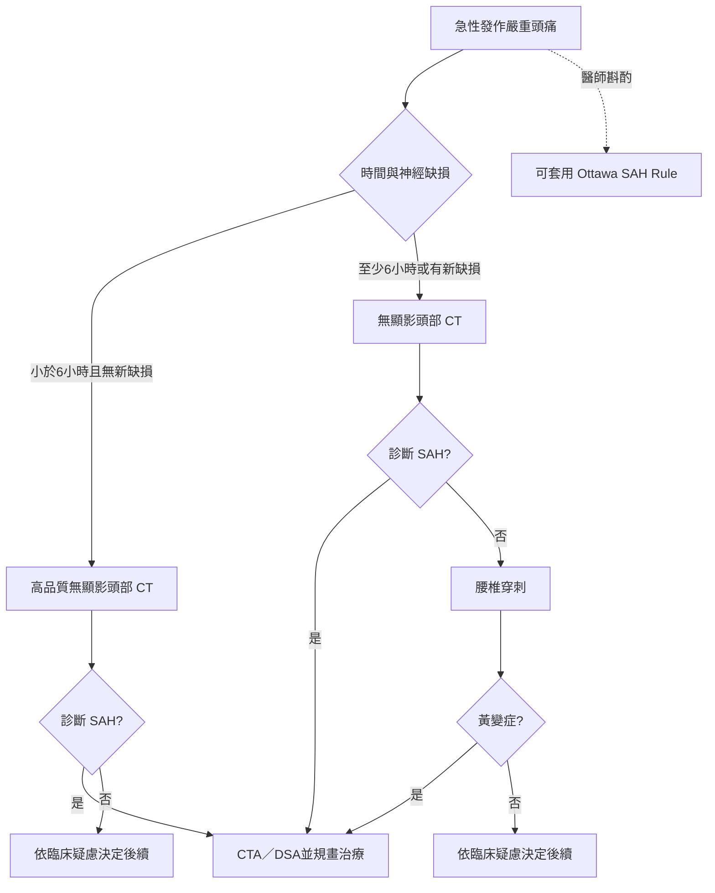

# 4. aSAH 的臨床表現與診斷

## 推薦表（e322）

### 評估是否為 aSAH

| COR | LOE | 建議 |
|---|---|---|
| 1 | B-NR | 急性發作的嚴重頭痛應迅速進行診斷檢查，以診斷或排除 aSAH，降低失能與死亡。 |
| 1 | B-NR | 急性嚴重頭痛若在症狀發作超過 6 小時才就醫，或有新發神經缺損，應先做無顯影頭部 CT；若 CT 未見 aSAH，應做腰椎穿刺（LP）。 |
| 2a | B-NR | 發作 6 小時內就醫且無新發神經缺損者，以高品質掃描器完成、並由具專科認證的神經放射科醫師判讀之無顯影頭部 CT，可合理用於診斷或排除 aSAH。 |
| 2b | B-NR | 急性嚴重頭痛且無新發神經缺損者，可考慮使用 Ottawa SAH Rule 辨認 aSAH 高風險病人。 |

### 評估 SAH 的病因

| COR | LOE | 建議 |
|---|---|---|
| 1 | B-NR | 自發性 SAH 若高度懷疑動脈瘤來源，但 CTA 陰性或無法確定，應做 DSA 以診斷或排除腦動脈瘤。 |
| 2a | B-NR | 已確認由腦動脈瘤造成的 SAH，可使用 DSA 判定最適當的介入策略。 |

## 綜述（e323）

清醒病人的典型 aSAH 表現，是突然發作且立刻達到最大強度的頭痛。aSAH 主要發作前，10%-43% 病人曾出現警告性或哨兵頭痛。誤診或延遲診斷可能造成死亡或嚴重失能。無顯影頭部 CT 仍是診斷 SAH 的核心，但後續檢查取決於距離症狀發作的時間與病人的神經學狀態。醫師必須判斷某項檢查是否真會改變臨床處置。

## 圖 2：疑似 aSAH 病人的診斷流程

**如何讀：**6 小時不是把 CT 從「可用」變成「無用」的魔法切點，而是改變陰性 CT 後殘餘風險是否足以接受。若超過 6 小時或已有神經缺損，單靠陰性 CT 不足，需以 LP 補上對出血本身的偵測。CTA／DSA回答的是「破裂源在哪裡」，不等同直接證明 CSF 空間裡是否曾出血。

## 各項推薦的支持文字（e323-e324）

### 1. 必須先維持高度懷疑

有效處理 aSAH 及其併發症，前提是及時辨認與初步處置。aSAH 可致命，漏診會帶來顯著失能與死亡。臨床醫師必須對此診斷保持警覺，必要時完成適當檢查；若能在災難性破裂前辨認哨兵出血，可能挽救生命。

### 2. 超過 6 小時或 CT 不確定時，LP 仍有獨立價值

對不符合 Ottawa SAH Rule 適用條件者，需以頭部 CT，必要時再以 LP 檢查黃變症。LP 常於症狀發作後 6-12 小時以上進行。Walton 等人整合 3 項研究共 1235 人：陰性或無法診斷的 CT 後，以分光光度法分析 LP 所得 CSF 的黃變症，敏感度為 100%，特異度為 95.2%。

美國急診醫學會對「高度懷疑 SAH、但無顯影 CT 無法確定」者，建議下一步可做 CTA 或 LP，證據等級為 C。然而，尚無研究直接比較正常／無法診斷 CT 後，以 CTA 或 LP 作為下一步的策略。CTA 不直接評估 SAH，只看腦血管病變，整體敏感度約 97.2%；對小於 3 mm 的破裂動脈瘤，另一分析估計敏感度只有 61%。因漏診 aSAH 後果嚴重，這些小差異仍具關鍵意義。發作超過 6 小時且高度懷疑 SAH 者，應以 LP 檢查黃變症。

### 3. 六小時內 CT 策略有嚴格前提

高品質 CT 對 SAH 具有高敏感度，尤其影像由受過次專科訓練、具認證的神經放射科醫師判讀。若病人在頭痛發作 6 小時內到院且沒有新發神經缺損，無顯影頭部 CT 未見 SAH，通常足以排除 aSAH。

2016 年統合分析納入 8907 人，6 小時內 CT 共漏掉 13 例 SAH，敏感度 98.7%、特異度 99.9%；換算後，每 1000 例 SAH 漏診少於 1.5 例。但這些分析多不適用於非典型表現，例如以頸痛、暈厥、癲癇或新發局灶神經缺損為主。缺乏典型雷擊頭痛不應阻止適當影像與檢查。

### 4. Ottawa SAH Rule 是高敏感度、極低特異度的排除工具

Ottawa SAH Rule 用於篩出 aSAH 機率很低者。出現嚴重頭痛且符合表 3 任一條件者，可能需依醫師判斷進一步檢查。原始研究納入 2131 人，其中 132 人（6.2%）有 SAH；敏感度 100%，特異度僅 15.3%。後續由原作者在 6 個中心前瞻驗證 1153 人、67 例 SAH，敏感度仍為 100%，特異度 13.6%。外部驗證 454 人、9 例 SAH，敏感度 100%，特異度只剩 7.6%。因此，它只能讓一小群低風險病人避免更多影像與風險，不能用來「確診」。

### 表 3：Ottawa SAH Rule

適用於 **15 歲以上、意識清楚、新發非外傷性嚴重頭痛，且 1 小時內達最大強度**者。若有下列任一項，需進一步檢查：

1. 年齡至少 40 歲；
2. 頸痛或頸部僵硬；
3. 有人目擊意識喪失；
4. 運動或用力時發作；
5. 雷擊頭痛，即疼痛瞬間達高峰；
6. 檢查發現頸部前屈受限。

**容易誤讀之處：**這六項是「任一陽性就不能停」的條件，不是加總分數；而且只適用於特定頭痛族群。規則陽性很常見，並不表示病人很可能真的有 SAH。

### 5. 已見 SAH 後，CTA 陰性不一定結案

CTA 普遍可取得，無顯影 CT 診斷 SAH 後通常接著進行。不同出血分布對潛在動脈瘤的機率不同，例如瀰漫性基底池及 Sylvian fissure SAH，比少量局部皮質 SAH 更像動脈瘤來源。對瀰漫性 SAH，不論 CTA 結果如何，均應以 DSA 評估，因 CTA 空間解析度有限，小型動脈瘤或其他血管病變可能未被充分看見或描繪。

### 6. DSA 不只找瘤，也描繪治療幾何

DSA 是評估腦血管解剖與動脈瘤幾何的黃金標準，可協助選擇最適治療方式。在某些臨床情境，CTA 單獨也可支持治療決策。

## 知識缺口與未來研究

- **MRI 的用途：**仍需評估既有與新興 MRI 序列偵測及描述 aSAH 的診斷準確度。
- **中腦周圍型 SAH：**對此出血分布應只做 CTA，或仍需導管 DSA，目前仍無定論。
- **新興技術：**雙能量 CT 與光子計數 CT 可能有助於偵測 SAH 與動脈瘤。

## 本章核心

診斷鏈有兩個不能互相替代的問題：**第一，蛛網膜下腔裡有沒有血？第二，血從哪一個血管病灶而來？**CT／LP 主要回答前者，CTA／DSA主要回答後者。把 CTA 陰性當成「沒有出血」，或把找到偶發動脈瘤當成「它一定是破裂源」，都是跨層作答。

