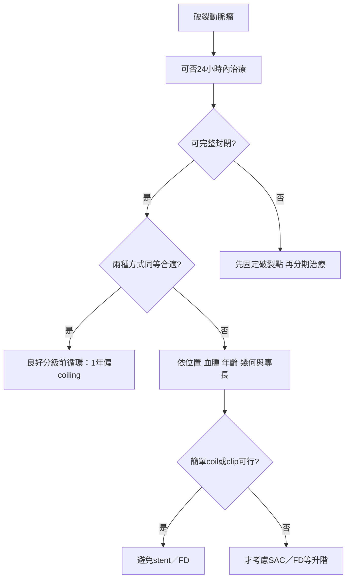

# 7. 破裂腦動脈瘤之外科與血管內治療

## 7.0 推薦表（e327-e328）

### 治療時機

| COR | LOE | 建議 |
|---|---|---|
| 1 | B-NR | aSAH 病人的破裂動脈瘤應在到院後儘早以外科或血管內方式治療，最好於發作後 24 小時內完成，以改善結果。 |

### 治療目標

| COR | LOE | 建議 |
|---|---|---|
| 1 | B-NR | 只要可行，應完整封閉破裂動脈瘤，以降低再出血及再次治療風險。 |
| 2a | C-EO | 若急性期無法以夾閉或 primary coiling 完整封閉，可合理先部分封閉並固定推定破裂點；功能恢復者再延後完成治療，以預防再出血。 |

### 治療方式：一般原則

| COR | LOE | 建議 |
|---|---|---|
| 1 | B-R | 後循環破裂動脈瘤若適合 coiling，應優先於 clipping，以改善結果。 |
| 1 | B-R | 可挽救的 aSAH 病人若因大型腦實質內血腫而意識下降，應緊急清除血腫，以降低死亡率。 |
| 1 | C-EO | 破裂動脈瘤應由具血管內與外科專長的專家評估，依病人及動脈瘤特徵比較兩類治療的風險與獲益。 |
| 2b | B-R | 70 歲以上 aSAH 病人，coiling 或 clipping 何者較能改善結果，尚未確立。 |
| 2b | C-LD | 40 歲以下 aSAH 病人，可考慮以 clipping 為優先，以提高治療耐久性與結果。 |

### 同時適合 clipping 與 coiling 的動脈瘤

| COR | LOE | 建議 |
|---|---|---|
| 1 | A | 良好分級、前循環破裂動脈瘤，且 **同等適合 primary coiling 與 clipping** 者，為改善 1 年功能結果，建議優先 primary coiling。 |
| 2a | B-R | 同一族群若著眼於良好長期結果，兩種方式均屬合理。 |

### 血管內輔助裝置

| COR | LOE | 建議 |
|---|---|---|
| 2a | C-LD | 破裂寬頸動脈瘤若不適合外科夾閉或 primary coiling，以 stent-assisted coiling 或 flow diverter 治療是合理的，可降低再出血。 |
| 2a | C-LD | 破裂 fusiform／blister 動脈瘤使用 flow diverter 是合理的，可降低死亡。 |
| 3：有害 | B-NR | 破裂囊狀動脈瘤若可用 primary coiling 或 clipping 治療，不應使用 stent 或 flow diverter，以避免更高併發症風險。 |

## 綜述（e328）

aSAH 病人應在可行時儘快修復動脈瘤，降低常致命的再破裂風險；然而，治療方式的選擇高度細緻。固定動脈瘤的目標必須與程序風險平衡。開放手術與血管內技術各有利弊，必須依個別病人的年齡、動脈瘤幾何與位置、是否合併腦實質出血等因素審慎衡量。

有時因技術限制，或程序風險高於獲益，無法完整封閉。若一個中心能同時提供血管內與開放手術，病人較可能獲得最合適的治療。值得注意的是，支持治療方式選擇的證據品質相對有限；不同血管內技術彼此比較，或與手術比較的資料尤其缺乏。

## 各項推薦的支持文字（e328-e330）

### 1. 越早固定越好，但「超早」不等同不顧條件立即做

早期治療破裂動脈瘤可降低再出血，也使 DCI 的治療更容易。直接研究治療時機的隨機前瞻試驗只有一項，且規模小、來自 coiling 普及前，納入 159 名良好分級病人；結果顯示，SAH 後 0-3 天手術，相較第 4-7 天或第 8 天以後手術，3 個月死亡或依賴較少。

後續 clipping／coiling 觀察研究及 ISAT 事後分析，對早期的定義不一，包括發作後 24、48 或 72 小時。統合分析與個別病例系列支持早期治療，包括高分級病人。資料顯示，發作後小於 24 小時相較超過 24 小時有益；但尚未證明小於 24 小時優於 24-72 小時。若病人在第 4-7 天才到院，仍應治療而非延至 7-10 天後；不應只因已進入常見 DCI 時窗就把固定動脈瘤繼續推遲。

### 2. 完整封閉同時降低再出血與再次治療

破裂動脈瘤若未完整封閉，再出血與再次治療風險都顯著較高。因此，只要可行，初次治療目標就是完整封閉。

### 3. 若完整封閉代價太高，可先固定破裂點

跨專科討論後，若初次治療無法以 clipping 或 primary coiling 完整封閉，急性期可先部分治療，目標是固定推定破裂部位並降低早期再出血。之後通常在 1-3 個月內，依病人功能狀態與恢復程度完成再次治療，以防未來再出血。

**闡釋：**這是「分期完成同一個治療目標」，不是把殘餘瘤視為成功終點。急性期先處理迫近的再破裂風險，待病人度過高風險期後，再追求耐久封閉。

### 4. 後循環若可 coil，證據偏向 coiling

Cochrane review 納入的兩項 RCT 對後循環動脈瘤的次群分析只有 69 人，樣本有限，但死亡或依賴的 RR 為 0.41（95% CI 0.19-0.92），支持 coiling 優於 clipping。前瞻性對照 BRAT 也顯示，後循環動脈瘤在 1 年及更長追蹤時，coil 組結果均顯著較好。

### 5. 大型血腫造成意識下降時，時間壓力來自腫塊效應

一項 coiling 時代前的小型 RCT 納入 30 名破裂動脈瘤合併大型腦內血腫、嚴重意識下降或神經缺損，但仍有自主呼吸及疼痛反應的病人；比較緊急手術與保守治療。血腫清除／夾閉組死亡率為 27%，保守組為 80%；獨立結果分別為 53% 與 20%。觀察資料也顯示，血腫大於 50 cm³ 者，良好結果組由發作至治療的時間顯著較短。

小型回溯研究雖指出可先 coil 固定動脈瘤，再清除血腫，但其血腫常較小（例如 >30 cm³）且有選擇偏誤。大型血腫需要快速解除腫塊效應，因此通常偏向不延遲地手術清除並同時 clipping。

### 6. 治療比較的前提是兩種專業都真正存在

形成治療方式建議的研究，通常要求血管內與外科專家共同參與。ISAT 對「同時適合 coiling 與 clipping」的判定，依賴兩類專家判斷；BRAT 亦要求兩種技術的專業人員都在場。因此，應由個別或團隊形式、同時熟悉兩種治療的專家評估相對風險與獲益。

**闡釋：**若某中心只會其中一種，所謂「病人最適合這一種」可能只是可得性反映，而不是中立比較。

### 7. 高齡本身不構成 coiling 必勝的證據

臨床常優先為 70 歲以上病人 coiling，但資料不足以證明清楚優勢。ISAT 依年齡分析時，70 歲以上 coiling 對死亡／依賴的 RR 為 1.15（95% CI 0.82-1.61），未顯示獲益。65 歲以上族群的結果會隨位置改變：internal carotid 與 posterior communicating artery 動脈瘤以 coiling 較佳，破裂 MCA 動脈瘤則 clipping 較佳。非隨機登錄與觀察資料亦未證明 75 歲以上病人的結果由治療方式決定。

### 8. 年輕病人的選擇更重視數十年的耐久性

年輕病人預期壽命較長，而 clipping 對再破裂的長期保護較佳，因此可考慮 clipping。ISAT 次群分析顯示，50 歲以下由 coiling 得到的利益較小；依 ISAT 資料計算，40 歲以下可能由 clipping 獲得較大優勢。

### 9. 一年功能結果：在嚴格選定族群中，coiling 較佳

四項 clipping 對 coiling RCT 的 Cochrane review 顯示，primary coiling 在 1 年功能獨立（mRS 0-2）機率較高；死亡／依賴 RR 為 0.77（95% CI 0.67-0.87）。結果主要由 ISAT 驅動；該試驗入選的是被判定兩者皆合適的病人，其中 97% 為前循環動脈瘤，多數為 WFNS 1-3。

**最重要的限定詞：**這不能外推成「所有破裂動脈瘤 coil 都優於 clip」。它只直接支持良好分級、以前循環為主，且兩種方式同等合適的選定族群。

### 10. 長期功能結果差距縮小，但風險型態不同

整體而言，primary coiling 與 clipping 的長期功能結果無顯著差異。ISAT 排除治療前死亡後，1 年死亡／依賴仍偏向 coiling（RR 0.77，95% CI 0.67-0.89），但死亡本身無顯著差異（RR 0.88，95% CI 0.66-1.19）。到 5 年時，死亡／依賴（RR 0.88，95% CI 0.77-1.02）與死亡本身（RR 0.82，95% CI 0.64-1.05）均無顯著差異。

BRAT 在 1 年亦偏向 coiling，但 3 年與 6 年時，原始全體 SAH 族群或只看囊狀動脈瘤，都不再見顯著優勢。長期資料另顯示：coiling 的再出血略多，clipping 的癲癇較多。

### 11. Stent／flow diverter 是無法使用較簡單方案時的升階選項

相較 primary coiling（包括 balloon-assisted 技術）或 clipping，stent-assisted coiling 與 flow diverter 的併發症及再出血風險較高；但其他方式不可行時，它們仍可有效封閉動脈瘤或降低再出血。若預期需要此類裝置，在介入前先完成 ventriculostomy，再開始抗血小板治療，可能降低 ventriculostomy 相關出血。

### 12. Blister 動脈瘤的問題是血管壁缺損，不是一般囊袋

Blister（blood-blister-like）動脈瘤是源自動脈壁缺損的 pseudoaneurysm，破裂風險與病害、死亡均高。它通常不適合 primary coiling 或標準 clipping，而需更複雜的 wrapping、顱外－顱內 bypass 等手術。小型回溯病例系列的統合分析顯示，flow diverter 的病害與死亡率大致可與手術策略相比。

### 13. 能不用母血管內永久裝置，就不應在急性破裂期使用

Stent-assisted coiling 與 flow diverter 比 primary coiling 更容易致血栓，因此需要雙重抗血小板治療。在破裂動脈瘤中，這會增加出血併發症，特別是 ventriculostomy 相關出血。因此，只要能用 primary coiling（包括 balloon-assisted）或 clipping，即使只能先部分固定破裂點，也應避免急性期使用 stent 或 flow diverter。

## 知識缺口與未來研究（e329-e330）

- **超早期治療：**早期治療證據很強，但治療時機多非前瞻性分派、定義也不一。沒有資料證明必須 6 小時內或全天候半夜立即處置；夜間資源不佳可能反而降低品質，或阻礙轉送完整型中心。
- **生活品質與認知：**clip 與 coil 對生活品質及神經認知結果的差異資料有限。
- **高分級 aSAH：**臨床常偏向 coiling，但缺乏專門比較高分級病人 clip／coil 的強健隨機證據。
- **前循環分叉瘤：**MCA 與前循環分叉動脈瘤通常被認為較適合 clipping，有限資料支持此觀點，但不足以下定論，尤其血管內技術持續演進。
- **新型 flow diversion：**囊內 flow diverter 與較低致血栓性的血管內 flow diverter，可能減少 DAPT 及相關併發症。有限非比較資料顯示囊內裝置可防再出血且結果可接受，但比較與長期資料不足。
- **演進中的血管內技術：**新技術可能增加治療選項，但不能把舊型 primary coiling 的效益直接外推。廣泛採用前，應與既有方式進行前瞻比較。

---

# 7.1 aSAH 外科與血管內治療的麻醉管理

## 推薦表（e330）

| COR | LOE | 建議 |
|---|---|---|
| 2a | B-R | 術中使用 mannitol 或高張食鹽水，可有效降低 ICP 與腦水腫。 |
| 2a | B-NR | 麻醉目標應包括減少術後疼痛、噁心與嘔吐。 |
| 2a | B-NR | 動脈瘤手術中預防高血糖與低血糖，是改善結果的合理作法。 |
| 2a | C-LD | 破裂動脈瘤尚未固定時，術中頻繁監測與控制血壓，可合理用於預防缺血及再破裂。 |
| 2b | B-NR | 術中神經監測可考慮用於引導麻醉與手術管理。 |
| 2b | C-LD | 術中動脈瘤破裂失控時，可考慮 adenosine 誘發心搏暫停與短暫深度低血壓，以利夾閉。 |
| 3：無益 | B-R | 良好分級 aSAH 手術時，常規誘導輕度低體溫沒有益處。 |

## 綜述（e330）

直接研究破裂動脈瘤修復術中麻醉的資料有限，實務多由周術期研究推導；開放手術的麻醉原則大致也適用於血管內治療。全身麻醉通常以平衡技術結合催眠、鎮痛與失憶藥物，同時避免病人移動；持續輸注部分催眠及鎮痛藥可維持穩定麻醉。目標包括血流動力穩定、合宜通氣，以及暴露、夾閉或 coil 部署時完全不動。可能時應調整藥物，使程序結束後儘快取得神經學檢查。

神經介入可在局部鎮靜或全身麻醉下進行。鎮靜可能較適合全身共病嚴重者，但缺乏結果資料；混亂或神經缺損使鎮靜困難，全身氣管內麻醉則能控制通氣與不動。神經麻醉醫師可藉有效管理抗凝，以及維持全身與腦部血流動力，減少併發症嚴重度。

## 各項推薦的支持文字（e330-e332）

### 1. Mannitol 與高張食鹽水都能讓腦鬆弛，但全身效應不同

雖沒有 aSAH 專屬術中高滲透壓藥研究，這些藥已廣泛使用。一般避免低滲透壓液體，偏好等滲，必要時高滲液體。血管性或細胞毒性水腫會增加局部與全腦缺血風險，也使手術暴露更困難；mannitol 與高張食鹽水均可降低 ICP、增加 CBF 並改善腦鬆弛。

Mannitol 是強效利尿劑，可能造成低血容量與低血壓；高張食鹽水提高血鈉、利尿作用較小，並可能升高血壓。現有證據不足以推薦其中一種，也不能確定兩者是否改變臨床結果。

### 2. 疼痛、噁心與嘔吐會妨礙安全與神經評估

Coiling 或 clipping 後噁心嘔吐會增加胃內容物吸入風險。aSAH 專屬發生率未知，但開顱後為 22%-70%。建議使用作用於不同化學受器的多模式方案。常用藥包括 5-HT3 antagonist（如 ondansetron）、steroid（如 dexamethasone）及其組合；也常主張加入 propofol、減少 narcotic 並維持 euvolemia。

較高劑量 anticholinergic（如 scopolamine）與 phenothiazine（如 promethazine）可能造成混亂或鎮靜，妨礙神經學檢查。開顱時揮發性麻醉藥相較 propofol 等靜脈藥，與較高術後噁心嘔吐率相關；鎮痛方面 dexmedetomidine 可能優於 fentanyl。仍需比較不同方案的試驗。

### 3. 高、低血糖都應避免

aSAH 周術期血糖控制不佳與較差結果相關。術中濃度管理尚未充分研究，但合理做法是同時預防高血糖與低血糖。IHAST 事後分析顯示，常見的高血糖與長期認知及整體神經功能變化相關。

### 4. 容量與血壓必須在全周術期連續管理

aSAH 破裂後可同時存在心血管功能障礙、全身發炎、自動調節失敗與擴散性去極化，且都受血管內容量影響。術中頻繁監測與控制血壓，可合理預防缺血與再破裂。低血容量常使升壓劑需求增加，尤其需要誘導高血壓時；周術期低血容量可能增加 DCI，高血容量則沒有益處，快速降壓也可能有害。血壓管理必須涵蓋整個周術期，包括病人運送。

### 5. 神經監測提供即時功能警報，但結果證據仍不完整

術中神經監測可即時評估腦功能完整性，常用自發 EEG、體感誘發電位與運動誘發電位。傳統上用於開顱，一些中心也用於 coiling；麻醉方案需配合最佳化訊號。雖無前瞻研究證實可改善結果，近期回溯研究亦曾質疑其在選擇性動脈瘤處置的整體效益，但累積證據仍支持使用。暫時夾閉時，若能避免低血壓，藥物誘導 EEG burst suppression 也可能合理。

### 6. Adenosine 是選定情境的短暫「停流工具」

若術中破裂失控，可考慮 adenosine 造成短暫深度低血壓，協助暴露與放置 clip。其起效及消退快速且反應可預測，數秒內作用，提供短暫深度全身低血壓；文獻描述可達約 45 秒的可預測心搏暫停。

禁忌包括 sinus node disease、二或三度 AV block，以及支氣管收縮／痙攣性肺病。第一度 AV block、bundle branch block 或心臟移植史應謹慎；冠心病病人可能發生 cardiac arrest、持續性 ventricular tachycardia 或 myocardial infarction。

### 7. 常規輕度低體溫未改善良好分級病人的結果

全身低體溫曾被研究用以減輕手術期間缺血傷害。早期研究提示神經效益，但一項多中心前瞻 RCT 納入 1000 名良好分級（WFNS 1-3）病人，未改善術後 3 個月神經結果。事後分析比較目標 33°C 與 36.5°C，在暫時夾閉病人的認知、24 小時及 3 個月結果均無差異。

結果未必可外推到高分級病人，而且復溫策略未標準化。少量研究比較輕度低體溫與正常體溫，仍需更大研究。術中高體溫在 aSAH 尚未直接研究，但周術期高體溫與較差結果相關。

## 麻醉相關知識缺口

- **血壓與容量：**麻醉誘導前及術中常規放 arterial line 的效益、不同 ICP／急性破裂情境的血壓範圍、最適術中容量狀態均未確立。Albumin 的神經保護證據有限；ALISAH pilot trial 發現心臟併發症隨劑量增加。
- **麻醉藥：**最適方案資料不足、實務多由機構決定；麻醉藥對長期神經結果與 conditioning 的影響未知。Ketamine 可能影響檢查，但因可能減少 DCI 相關梗塞與擴散性去極化，值得重新評估。β-blockade 或 narcotic 降低 sympathetic activation 是否影響死亡也不清楚。
- **通氣：**程序期間 PaCO₂ 的最適管理目標資料有限。
- **血糖與電解質：**術中 glucose、sodium 等管理是否改變結果，仍需更多資料。
- **次專科訓練：**神經麻醉專科與一般麻醉醫師照護的結果差異，資料不足。

## 第 7 章決策閉環

這個流程的核心不是先問「clip 還是 coil」，而是依序回答：**何時必須固定、能否完整固定、兩種方式是否真的同等適合、是否存在改變優先順序的條件，以及是否被迫使用需要母血管內裝置與 DAPT 的升階技術。**

