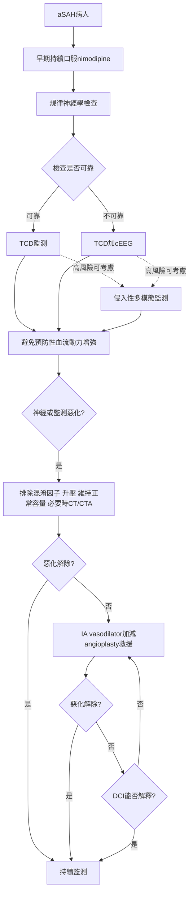

# 8. aSAH 相關內科併發症

## 8.0 推薦表（e332-e333）

### 肺部管理

| COR | LOE | 建議 |
|---|---|---|
| 1 | B-NR | 需要機械通氣超過 24 小時者，應採標準化 ICU 照護 bundle，以縮短機械通氣並減少院內肺炎。 |
| 2b | B-NR | 若發生重度 ARDS 與致命性低血氧，可在 ICP 監測下考慮 prone positioning、alveolar recruitment 等救援措施，以改善氧合。 |

### 血管內容量與電解質

| COR | LOE | 建議 |
|---|---|---|
| 2a | B-R | 應密切監測並以目標導向處理容量狀態，以維持 euvolemia。 |
| 2a | B-R | 可合理使用 mineralocorticoid 治療 natriuresis 與 hyponatremia。 |
| 3：有害 | B-R | 誘導 hypervolemia 可能有害，因與額外病害相關。 |

### 其他

| COR | LOE | 建議 |
|---|---|---|
| 1 | C-LD | 破裂動脈瘤固定後，應給予藥物或機械性 VTE 預防，以降低 VTE。 |
| 2a | B-NR | 有效控制血糖、嚴格處理高血糖並避免低血糖，是改善結果的合理作法。 |
| 2b | C-LD | 急性期發燒且退燒藥無效時，TTM 的臨床效益仍不確定。 |

## 綜述（e333）

相當多 aSAH 病人會出現多系統內科併發症，包括感染或中樞性發燒、全身發炎症候群、cerebral salt wasting 或 SIADH 所致低血鈉、肺炎與敗血症、VTE、neurogenic stunned myocardium 等心臟併發症，以及需要機械通氣的呼吸衰竭或 ARDS。合併內科併發症者結果較差；預防、及時診斷與治療，加上高品質重症支持，是改善整體結果的重要部分。

## 各項推薦的支持文字（e333-e335）

### 1. 呼吸器 bundle 把多個小風險一起壓低

需要機械通氣的呼吸衰竭、醫療照護相關肺炎與 ARDS 都可能在 aSAH 急性期發生並影響結果；ARDS 本身是較差 SAH 結果的獨立相關因子。近期多中心觀察研究報告，aSAH 前 7 天 ARDS 發生率最高約 3.6%。

大型 cohort 顯示，腦傷且使用呼吸器的病人採 bundled care，可更快達拔管準備、縮短通氣時間，並增加無呼吸器及無 ICU 日數。內容包括肺保護低潮氣量、適度 PEEP、早期腸道營養、院內肺炎抗生素標準化，以及系統化拔管流程。

### 2. 重度 ARDS 的救援措施可做，但必須同時看腦壓

aSAH 急性肺損傷可達 27%，與更高治療強度、更長 ICU 住院及不良結果相關；COVID-19 前 ARDS 報告範圍為 3.6%-27%。重度 ARDS 的 recruitment、較高 PEEP 與 prone positioning 在重度腦傷中具爭議，因可能升高 ICP。

小型 RCT 顯示，在有 ICP monitor 的 aSAH 病人，alveolar recruitment 與 prone positioning 可提高 PaO₂，而不造成病理性 ICP 或 CPP。雖無研究直接比較有無 ICP 監測的安全性，考量病情危重與現有安全資料，需要這些操作時仍宜監測 ICP。

### 3. CVP 不是可靠的血管內容量替代指標

重症病人的最適容量評估與 fluid responsiveness 監測仍有爭議。大量證據顯示，CVP 與循環血量相關很差，也無法預測 fluid challenge 的血流動力反應，因此不能作為充分的血管內容量代理指標。

SAH 可因 natriuresis 造成容量不足，可能與 DCI 及較差結果相關，所以許多專家主張連續監測並最佳化有效循環血量。以 cardiac output、preload、stroke volume variability 等參數導引血管內／外科治療與 ICU 期間的早期目標導向治療，比傳統方法更容易偵測並處理脫水或容量不足；但整體研究未一致改善 vasospasm、DCI、死亡或功能結果。一項 RCT 提示，高分級 aSAH 在發作 24 小時內採早期目標導向監測，可能減少後續 DCI、ICU 住院及 mRS 4-6 的不良結果。

### 4. Mineralocorticoid 改善排鈉與容量需求，但未穩定改善 DCI 或結果

低血鈉可伴或不伴多尿／natriuresis，是 aSAH 常見表現；cohort 對其是否與 DCI 及不良結果相關，結論不一。具臨床意義的低血鈉與未控制 natriuresis 可造成容量不足，引發額外神經與全身惡化，常需高強度 ICU 介入。

數項中型 RCT 顯示，fludrocortisone 可減少過度排鈉、尿量、低血鈉及靜脈輸液需求，但未一致減少 DCI 或改變結果。主要副作用是低血鉀與需要補鉀，未見其他顯著病害。高劑量 hydrocortisone 對血鈉、尿鈉與 natriuresis 有類似效果，但高血糖、低血鉀、腸胃出血與心衰竭較多。多數舊 RCT 同時採延後動脈瘤治療或誘導 hypervolemic hypertensive hemodilution，可能混淆藥物與結果的關係。

### 5. 預防性 hypervolemia 增加併發症，卻未降低 DCI

歷史上常以 crystalloid、albumin 等 colloid 或輸血誘導 hypervolemia，作為 triple-H therapy 的一部分，試圖預防 DCI。現有 RCT 顯示，容量擴張會增加內科併發症，卻未改善整體結果或降低 DCI。僅一項研究見周術期次級缺血減少，但整體結果未改善。

### 6. 動脈瘤固定後應開始 VTE 預防；最佳時點仍不清楚

急性 aSAH 約 4%-24% 發生 VTE。例行無症狀篩檢可能增加隱匿 DVT 偵測，但是否改善結果不清楚。CLOTS 3 是最大型物理性預防 RCT，研究 intermittent pneumatic compression，但未納入 aSAH。

一項小型 RCT 在動脈瘤治療後每日 enoxaparin 40 mg 皮下注射，未增加出血，可能減少 VTE，但未改善整體結果；低分子量 heparin 回溯研究也未見顯著出血。相對於動脈瘤封閉與神經外科程序的最佳起始時間仍未知。一項 case-control 比較封閉後 24 小時內與超過 24 小時開始預防，早期組未發生顱內出血；延後組有 3 名同時使用 DAPT 者發生嚴重顱內出血。

### 7. 高血糖是風險標誌，但過度嚴格控制也可能傷腦

入院、動脈瘤手術期間，或到院 72 小時內高血糖，無論是否有糖尿病，均與 vasospasm、DCI、短長期不良功能及死亡相關。但應設定何種門檻、監測與治療多密集，以及治療是否真改善結果，資料互相衝突。入院急性高血糖也可能只是初始腦傷嚴重度的標誌，而非可改變的次級傷害因素。

數項小型 RCT 比較嚴格與傳統控制，未見結果獲益；其中一項以 80-120 mg/dL 為目標，感染率較低，但整體結果未改善。關鍵疑慮是 tight control 可能造成全身或腦部低血糖與代謝危機，反而加重急性腦傷。

### 8. 降溫能控制數字，但尚未證明改善結果

急性 aSAH 發燒常見、常對傳統退燒藥反應差，且與較差結果相關。各研究對發燒定義及治療／TTM 是否改善結果高度異質。可用方法包括藥物、具或不具 feedback loop 的表面降溫，以及血管內降溫。

目前沒有任何單一或組合方式證明改善結果，儘管多數可有效控制體溫。TTM 可能造成 shivering 而需藥物抑制、延長鎮靜與機械通氣、延長 ICU、低血壓，以及血管內裝置的導管併發症。小型 RCT 顯示輕度低體溫可執行，但不同降溫方式對發炎生物標記的影響可能不同。

## 知識缺口與未來研究

- **輸血門檻：**貧血常見且與較差結果相關；紅血球輸血可增加腦氧，卻可能造成內科併發症與較差結果。最佳 Hb 門檻與適應症未知，多中心試驗仍進行中。
- **全身發炎與感染：**SIRS 常見且使結果惡化，但感染性與非感染性原因難以區分。肺炎、敗血症常見且有害，治療感染是否改善整體結果仍未直接證實。發炎可能參與腦傷，但 glucocorticoid 等抗發炎藥在 aSAH 的安全與效益研究不足。
- **心肺停止：**約 4% aSAH 早期 cardiac arrest，存活者約四分之一仍可有良好結果；最佳治療與預後判斷資料不足。
- **心臟併發症：**心律不整、心肌損傷生物標記與 cardiomyopathy 常見，但研究多集中於預測價值，缺乏特定管理證據。
- **蛋白質營養不良：**常見；高蛋白補充可能改善合併感染等選定族群，但影響與最佳方案未知。
- **循環容量：**不論目標是 hypervolemia 或 euvolemia，如何準確量測仍缺乏證據。I/O 與 CVP 估計伴隨較多未識別的 hypovolemia，沒有黃金標準；高輸液量反與 DCI 相關。小型 RCT 提示進階監測的目標導向治療可減少容量不足，高分級病人可能降低 DCI。
- **發燒與 TTM：**最佳目標溫度、持續時間、裝置及副作用對結果的影響仍待研究。

---

## 8.1 護理介入與活動

### 推薦表（e335）

| COR | LOE | 建議 |
|---|---|---|
| 1 | B-R | 應使用實證 protocols 與 order sets，提高照護標準化。 |
| 1 | B-NR | 應以 GCS、NIHSS 等工具頻繁進行神經評估，監測 DCI 與其他次級併發症。 |
| 1 | B-NR | 應頻繁監測生命徵象與神經狀態，以偵測變化並預防次級腦損傷與不良結果。 |

| COR | LOE | 建議 |
|---|---|---|
| 1 | B-NR | 開始經口攝取前，應執行經驗證的吞嚥障礙篩檢，以降低肺炎。 |
| 2a | C-LD | 專門的中風護理能力與認證，可改善結果、照護即時性及 protocol 遵從。 |
| 2a | C-LD | 動脈瘤已固定者，採早期實證活動演算法是合理的，可改善出院功能層級與 12 個月整體功能。 |

### 綜述（e336）

護理評估與介入自到院開始，延續整個住院與恢復期。專業護理是重症介入的骨架，目的在預防內科併發症並最大化良好功能結果。焦點包括維持 euvolemia、避免 BP variability，以及快速辨識與治療 DCI、腦水腫、水腦、發燒、高血糖與肺炎。

文獻把護理師的頻繁評估視為預防策略的關鍵。NIHSS、GCS 與經驗證的吞嚥篩檢，可使 vasospasm／DCI 更早被介入並降低肺炎。受中風專業訓練與認證的護理師，可能改善結果；遵循 aSAH order sets 與 protocols 則有助標準化並降低死亡。

### 1. Protocol 把需要持續執行的細節變成系統

一致、標準化的中風照護可縮短住院、降低 DCI，並改善 90 天功能。護理介入常由逐步演算法清楚定義。大型觀察性 QASC 試驗以護理師啟動「fever, sugar, swallowing」protocol，90 天死亡與依賴絕對改善 16%。4 年追蹤顯示，將 protocol 固化進流程後，病人完整接受 bundle 的比例增加 80%，90 天依賴仍較低。

中風專屬 order sets 是標準化照護的基礎；高血壓處理、nimodipine、及時治療動脈瘤等指標越符合 guideline，與較低 1 年死亡相關。

### 2. 神經量表的價值在追蹤變化，不只是單次分數

DCI 風險除影像外，也可能由動脈瘤大小、位置、Fisher score、氧合與神經檢查變化預測。最常用的是 GCS 與 NIHSS。大型次群分析顯示，單一 GCS 值不是獨立預測因子，但 GCS 下降至少 2 分與臨床 DCI 相關。多項研究未能證明 NIHSS 或 GCS 何者更優；VASOGRADE 等 DCI 專屬分層量表也能顯著預測。

### 3. 頻繁監測必要，但頻率應依病情個別化

早期辨識惡化對避免 DCI、腦水腫或水腦造成次級傷害至關重要。研究中的監測頻率從每 15 分鐘至每 4 小時，持續時間由出血後至少 48 小時至 7 天。一項研究在 clipping 後以 GCS／NIHSS 每小時評估 72 小時，發現 42.6% 有神經惡化。由於最佳頻率與期間沒有共識，應依病情複雜度與需求調整。

### 4. 吞嚥篩檢必須在任何經口給予之前

估計多達 65% 中風病人急性期有 neurogenic dysphagia，增加肺炎、住院、90 天不良功能與死亡。護理師最能在第一次經口飲食或藥物前完成篩檢。納入 4528 人的系統性回顧與次群分析顯示，護理師啟動吞嚥篩檢並使用正式 guideline，可顯著預防肺炎並降低死亡。另一大型回顧與單盲 cluster RCT 建議，入院 24 小時內使用經驗證工具。

### 5. 專業護理能力是可被訓練與稽核的介入

執行中風 protocols、order sets 與專門評估需要專業護理。一項前後測研究顯示，接受中風能力訓練的護理師，其知識與 guideline 遵從改善，並與住院縮短相關。能力包括 NIHSS、吞嚥篩檢、病人與家屬教育、ICP 升高監測及 EVD 管理。回溯比較發現，認證護理師的照護更及時、protocol 遵從更高；長期結果影響仍需更多研究。

### 6. 動脈瘤固定後，適當早期活動可能帶來長期功能獲益

不動會促成 VTE、壓瘡、肺炎與不良功能。早期復健活動未增加 DCI 頻率或嚴重度，並與 1 年良好整體功能相關。一項前瞻介入研究顯示，動脈瘤修復後前 4 天每達成一級活動，重度 vasospasm 風險降低 30%；另一護理師主導計畫中，參與者 90 天功能層級改善機率為未參與者 2.3 倍。

### 護理知識缺口

- 如何把護理活動群聚、如何選時，目前缺乏大型 RCT 與長期結果。
- 生命徵象與神經檢查的最佳頻率及持續時間未知。
- multimodal monitoring 對護理人力、教育與訓練的負擔未確立。
- 急性期病人／家屬教育對併發症與長期結果的效果缺乏專門研究。
- 護理活動可能短暫加重 ICP、降低 CPP、增加疼痛、干擾睡眠或造成血流動力波動，需要 risk-benefit 研究。
- 尚無驗證工具衡量頻繁監測造成的睡眠破壞。
- 護理能力、認證與 staffing ratio 如何影響結果，仍需標準化研究。

---

## 8.2 腦血管痙攣與 DCI 的監測及偵測

### 推薦表（e338）

| COR | LOE | 建議 |
|---|---|---|
| 2a | B-NR | 疑似 vasospasm 或神經檢查受限者，CTA 或 CTP 可用於偵測 vasospasm 並預測 DCI。 |
| 2a | B-NR | TCD 監測是偵測 vasospasm 與預測 DCI 的合理方法。 |
| 2a | B-NR | 高分級 aSAH 使用 cEEG 可協助預測 DCI。 |
| 2b | B-NR | 高分級 aSAH 可考慮侵入性監測腦組織氧、lactate/pyruvate ratio 與 glutamate，以預測 DCI。 |

### 綜述

腦動脈狹窄（vasospasm）常見，並與 DCI 及梗塞相關。DCI 約發生於 30%，多在 aSAH 後第 4-14 天。DCI 臨床惡化定義為新發局灶神經缺損，或 GCS 至少下降 2 分；持續至少 1 小時、不是動脈瘤封閉後立即出現，且不能由其他原因解釋。新發腦梗塞則定義為 aSAH 後 6 週內 CT／MRI 新見、且不能歸因其他原因的梗塞。

DCI 診斷困難。連續神經檢查重要，但高分級病人可觀察性有限，因此需以工具辨認動脈狹窄與灌流異常。常用 TCD、CTA／CTP 與 cEEG；侵入性方法包括 brain tissue oxygen partial pressure（PbtO₂）與 cerebral microdialysis。

### 1. CTA 看大血管，CTP 補上灌流與微循環

CTA／CTP 可評估 vasospasm 並引導治療。症狀出現時，CTA 偵測 central vasospasm 的敏感度約 91%，遠端血管準確度下降。TCD 升高而神經檢查受限時也很有用。前瞻 cohort 與 DSA 相比，CTA 診斷準確度 90%、偽陽性 5%。若 CTA 見重度 vasospasm，可因 DCI 風險分流至 angiography suite。

CTA vasospasm score 可直接預測 DCI 與不良神經結果；CTP 能較早預測灌流異常，除 CTA 所見 macroscopic vasospasm 外，也反映 microcirculation。CTP 對 DCI 的 PPV 約 0.67。aSAH 第 3 天進行 CTP，可在進入 vasospasm window 時評估風險，可能減少後續重複顯影劑與輻射。

### 2. TCD 適合床邊重複追蹤，但高度依賴操作者與生理背景

TCD 非侵入、安全，可動態重複評估。研究多聚焦 MCA，常以平均 CBF velocity ≥120 cm/s 且 Lindegaard ratio ≥3 定義 vasospasm。17 項研究、2870 人的統合分析中，TCD vasospasm 對 DCI 的敏感度 90%、特異度 71%、PPV 57%、NPV 92%。

與 cEEG、CTP、PbtO₂ 合併可能增加預測力。限制是 TCD 最多一天 1-2 次、依賴操作者、可能受 temporal bone window 限制，且心率與血壓也會影響讀值。

### 3. cEEG 把無法持續檢查的病人轉成連續功能訊號

cEEG 可連續測量腦功能與對缺血的可預期反應；quantitative EEG 讓大量原始資料得以快速濃縮，支持即時偵測癲癇與 DCI。預測特徵包括 alpha-to-delta ratio 下降、relative alpha power variability 下降、epileptiform discharges、rhythmic／periodic ictal-interictal continuum pattern，以及 isolated alpha suppression。

一項依診斷準確度報告標準設計的前瞻研究，預先定義四種警報：relative alpha variability 下降、alpha/delta ratio 下降、局灶慢波惡化、晚發 epileptiform abnormality。後續發生 DCI 者 96.2% 出現警報，未發生者 19.6%；警報領先中位 1.9 天（IQR 0.9-4.1），其中晚發 epileptiform abnormality 預測力最高。

### 4. 侵入性監測提供局部代謝窗口

PbtO₂ 是 regional CBF 的替代量，反映氧供、擴散與消耗平衡，可協助早期偵測 DCI 與腦缺氧，且探針可安全置入。Cerebral microdialysis 可偵測 extracellular fluid 的缺血代謝變化；lactate/pyruvate ratio 反映腦氧供，可作即將缺氧／缺血的生化標記。此比例與 glutamate 濃度均與高分級 aSAH 的 DCI 相關。

47 項研究的系統回顧支持 PbtO₂ 與 microdialysis 可辨認 DCI 高風險者。主要缺點是只反映探針附近局部環境，因此應置於最高風險區；雙側半球 microdialysis 可能提高偵測能力。

### 知識缺口

- TCD、cEEG 或侵入性 multimodal monitoring 是否因改變決策而改善長期結果，仍未證實。
- 侵入性研究受病人選擇、監測起始時機不一致與結果判定偏誤影響。
- Electrocorticography 很有潛力，但需驗證與自動化。
- 腦自動調節異常與 DCI 相關，但演算法及即時應用需驗證。
- 需判定 CBF monitor 變化是否可靠到足以引導治療。
- CTP 門檻何時應觸發侵入性 angiography 或內科治療，仍待驗證。

---

## 8.3 aSAH 後 vasospasm 與 DCI 的處置

### 推薦表（e339）

| COR | LOE | 建議 |
|---|---|---|
| 1 | A | 早期開始 enteral nimodipine，可預防 DCI 並改善功能結果。 |
| 2a | B-NR | 維持 euvolemia 可預防 DCI 並改善功能結果。 |
| 2b | B-NR | 症狀性 vasospasm 時，升高 systolic BP 可考慮用於降低 DCI 進展與嚴重度。 |
| 2b | B-NR | 重度 vasospasm 可考慮 intra-arterial vasodilator，以逆轉 vasospasm 並降低 DCI 進展與嚴重度。 |
| 2b | B-NR | 重度 vasospasm 可考慮 cerebral angioplasty，以逆轉 vasospasm 並降低 DCI 進展與嚴重度。 |
| 3：無益 | A | 不建議常規 statin 以改善結果。 |
| 3：無益 | A | 不建議常規 IV magnesium 以改善神經結果。 |
| 3：有害 | B-R | DCI 高風險者不應預防性增強血流動力，以減少醫源性傷害。 |

### 綜述（e340）

病人若度過初次破裂，DCI 仍是主要威脅。血管攝影所見 vasospasm 是 DCI 及病害死亡的重要預測因子；歷史上，未診斷或治療不足的 cerebral arterial vasospasm 常被視為 aSAH 尸解死亡原因。然而，DCI 造成腦組織喪失的機轉比 vasospasm 更複雜，包括血腦障壁破壞、微血栓、皮質擴散性去極化／缺血與自動調節失敗。只對 vasospasm 治療，對 DCI 或死亡的影響有限。

### 圖 3：vasospasm／DCI 的實務處置路徑

**圖表闡釋：**流程先做所有人都應接受的 prophylaxis（nimodipine）與 surveillance，再依神經檢查可靠性選監測。真正惡化時才升壓；若對內科處置無反應，才進入 IA vasodilator／angioplasty。圖中特別用紅色標出「不要預防性升壓」，因為症狀前把所有人推向高血壓／高容量只會增加醫源性傷害。

### 1. Nimodipine 的重點是早期且不中斷的腸道給藥

Nimodipine 是 dihydropyridine calcium-channel blocker，已獲 FDA 核准用於 aSAH 後臨床神經改善。持續腸道給予 60 mg、每日 6 次，可預防 DCI 並改善功能；最早來自 1983 年試驗，後由 16 項試驗、3361 人的統合分析確認。最佳起始時間仍有爭議。

Nimodipine 中斷與較高 DCI 發生相關（ρ=0.431，P<0.001）；能維持完整劑量與 DCI 呈負相關（ρ=-0.273，P<0.001）。因此，即使有 nimodipine-induced hypotension，只要能以標準內科措施處理，仍建議持續；若造成顯著 BP variability，才可能需暫停。靜脈或 intra-arterial nimodipine 資料不足，無法提出建議。

### 2. 目標是 euvolemia，不是 hypervolemia

維持 euvolemia 可預防 DCI 並改善功能。已記錄 volume depletion 的病人有 58% 發生 DCI；hypervolemia 則與較差結果及更多併發症相關。文獻對 euvolemia 定義不一，CVP 單獨不可靠；transpulmonary thermodilution 等進階 cardiac output 監測的額外價值也不確定。文獻支持以 crystalloid 維持正常容量。

一項目標導向研究中，DCI 在介入組為 13%、控制組 32%（OR 0.324，95% CI 0.11-0.86）；另一 euvolemic protocol 將 DCI 由 44.2% 降至 7.7%。維持 euvolemia 也可減少心肺併發症。

### 3. 誘導高血壓是症狀性 DCI 的治療，不是常規預防

BP variability 與較差結果相關；低血壓可能在原本代償的病人出現局灶缺損前先發生。DCI 通常以局灶缺損或 GCS 下降辨認，高分級病人因檢查受限而更困難。

一項 vasopressor 隨機試驗顯示，治療組在 DCI 時維持 CBF 有趨勢，但死亡、MI 與 arrhythmia 等嚴重不良事件較多、未達顯著。回溯研究中 norepinephrine 組神經改善多於 phenylephrine（94% vs 71%），回家或急性復健比例亦較高（94% vs 73%），併發症近似。

唯一誘導高血壓 RCT HIMALAIA 因未見腦灌流獲益且收案差而提前停止；功能結果無差異但檢定力不足。大型多年多中心觀察資料則顯示約 80% 症狀病人在 induced hypertension 後改善。綜合而言，對 DCI 病人可合理考慮。

### 4. IA vasodilator 可到達近端與遠端，但沒有最佳藥物的高品質比較

血管內選項眾多。IA vasodilator 可同時到近端與遠端血管，但藥物、劑量與療程差異很大；均可能造成全身低血壓，且沒有高品質隨機比較。Papaverine 雖有效，因 neurotoxicity 通常避免；IA nimodipine 並非所有地區可用。程序中另需注意 systemic hypotension 與血管擴張造成 ICP 上升。

以 cervical catheter infusion 是合理起點，intracranial microcatheter 留給較重病例。間歇注射在效益與併發症上通常優於持續輸注。IA infusion 可與 angioplasty 結合，分別處理不同層級血管。

### 5. Angioplasty 作用較耐久，但 vessel rupture 後果嚴重

Angioplasty 是改善重度 vasospasm 灌流的機械方法，傳統 balloon 主要限於 proximal vessel；compliant 或 noncompliant balloon 依操作者選擇。血管攝影反應不佳與復發 vasospasm 及 infarction 相關。需特別避免 vessel rupture，因其死亡率高，儘管現代安全性已改善。

Angioplasty 與 vasodilator 直接比較有限，但 balloon angioplasty 的血管攝影反應可能較耐久。若 diffuse spasm，可合併 IA vasodilator 以涵蓋更廣血管床。

### 6. Statin 可減少 vasospasm，卻未改善 DCI 或死亡

六項 aSAH statin RCT 的統合分析顯示 vasospasm 減少，但 DCI 與死亡無顯著獲益。一種假說是長療程增加 bacteremia，抵銷血管痙攣保護；短療程或組合策略仍研究中。以既有劑量策略，無結果獲益，因此不建議常規使用。

### 7. IV magnesium 的生理合理性沒有轉化為臨床效益

前臨床資料提示 magnesium sulfate 可增加 CBF、減少 vasospasm，但臨床未見結果獲益。兩篇 RCT 統合分析均未減少 cerebral infarction 或死亡。有人主張 CSF 濃度比周邊血濃度重要，但尚未驗證，因此不建議常規用來改善神經結果。

### 8. 預防性血流動力增強有害；milrinone 仍屬有希望但未定案

DCI／vasospasm 高峰在出血後第 6-10 天。研究以 colloid 或 dobutamine、norepinephrine、milrinone、phenylephrine 等升壓藥做預防性 augmentation，未改善神經結果，卻增加 congestive heart failure 等併發症。允許自動調節似乎較合理，因發展 DCI 時 BP 本身常上升，且與 vasospasm 發展相關。

Milrinone 近年依有限非隨機資料用於預防 DCI，靜脈輸注至風險高峰似乎耐受良好，可能減少症狀性 vasospasm／DCI；作用究竟來自 inotropy 或 cerebral vasodilation 不清楚，仍需研究。

### 知識缺口

- 需更準確 DCI 風險分層，並證明治療後功能真正改善。
- 組合治療與 platform／master protocol 試驗可能更有效，尚待探索。
- IA 藥物與新型 angioplasty device 雖廣用，缺乏高品質隨機與比較資料。
- 神經節阻斷可能影響 neurovascular unit／vasospasm，需研究其對 DCI 的作用。
- Antiplatelet／anticoagulation 預防 DCI 的證據不足或矛盾，無法支持或反對。
- Intrathecal haptoglobin、deferoxamine、vitamin D 與多種 vasodilator 有初步／動物資料，臨床仍不足。
- Lumbar drain 或 EVD 可加速清除 CSF 血液分解物；有限試驗提示 lumbar drain 降低 DCI，但族群與中心有限。
- Cisternal fibrinolytic／spasmolytic lavage 正在雙盲試驗中。

---

## 8.4 aSAH 相關水腦處置

### 推薦表（e343）

| COR | LOE | 建議 |
|---|---|---|
| 1 | B-NR | 急性症狀性水腦應緊急 CSF diversion（EVD 和／或 lumbar drainage），以改善神經結果。 |
| 1 | B-NR | 需 EVD 者應執行並遵循涵蓋置入、管理、教育與監測的 EVD bundle，以降低併發症與感染。 |
| 1 | B-NR | 慢性症狀性水腦應永久 CSF diversion，以改善神經結果。 |
| 3：無益 | C-LD | 不應常規 fenestration of lamina terminalis 以降低 shunt dependency。 |

### 綜述

aSAH 可造成急性或慢性症狀性水腦。相關文獻只有 1 項 RCT 與 3 篇聚焦風險因子的統合分析，多數是非隨機 case-control、case series 與 case report。急性期應考慮緊急 EVD。Ventriculostomy-associated infection 報告範圍小於 1% 至 45%；有目標的 bundled EVD protocol 是預防感染與其他併發症的最佳實務，核心應涵蓋置入技術、管理、監測與教育。

### 1. 症狀性水腦是立即引流問題

aSAH 急性水腦發生率約 15%-87%。合併症狀時應緊急以 EVD 或 lumbar drainage 引流，改善神經狀態。Lumbar CSF drainage 亦顯示可降低 DCI 並改善早期結果。即使沒有水腦，若懷疑 intracranial hypertension 仍可考慮 ICP monitoring。

EVD 或 lumbar drain 依出血與水腦的 CSF flow pattern 選擇。EVD 的最佳時機沒有資料；不能治療動脈瘤的中心在轉送前，仍應先穩定病人，必要時完成 CSF diversion／EVD。

### 2. EVD bundle 能大幅降低感染

1990-2013 年 10 個 bundled protocols 的回顧顯示，感染率由實施前 6.1%-37% 降至實施後 0%-9%。Aseptic technique 與 antibiotic-impregnated catheter 被廣泛接受；置入地點、操作者、導管型號與抗生素 coating 差異仍大。減少抽樣與無菌技術可能降低感染，但資料不足以制定更細規格。敷料管理也是 bundle 要素，各機構作法不一。

### 表 4：EVD 感染控制 bundle 要素

| 置入與技術 | 管理 | 監測與教育 |
|---|---|---|
| EVD setup、無菌技術、皮膚準備 | 敷料種類與更換頻率 | 置入／管理人員訓練 |
| 置入地點（ICU、OR 等）與置入者 | EVD flushing | 員工教育與能力認證 |
| 導管尺寸、類型、是否抗生素浸潤 | CSF 採樣頻率與技術 | 監測 catheter-days 與感染率 |
| Procedure timeout | 操作、導管／系統更換 | 統一感染定義、EVD order panel |
| - | 護理交班、clamping、weaning | 活動安全 |

**闡釋：**bundle 並非某一條導管或一次抗生素，而是把感染可能進入系統的每個接點都標準化：置入、後續開關與採樣、人員交接、每天是否仍需要，以及拔除／weaning。

### 3. 慢性症狀性水腦需要永久引流

aSAH 後 persistent／chronic shunt-dependent hydrocephalus 約 8.9%-48%。顯著預測因子包括到院神經分級差、高齡、急性水腦、高 Fisher grade、IVH、再出血、後循環或 ACom aneurysm、clipping、coiling、vasospasm、meningitis 與 EVD 時間長。

大型觀察研究顯示，破裂或未破裂動脈瘤接受 clipping 或 coiling 後，因水腦置放 ventricular shunt 的比率相近；永久 CSF diversion 可改善 aSAH 後神經結果。

### 4. Lamina terminalis fenestration 不應常規用來避免 shunt

11 項研究、1973 人的統合分析中，fenestration 與 shunt-dependent hydrocephalus 減少無顯著關係：fenestration 組 10%、未 fenestration 組 14%（P=0.089），RR 0.88（95% CI 0.62-1.24）。

### 水腦知識缺口

- 高分級但無水腦者 ICP monitoring 的益處資料有限。
- 動脈瘤固定前先引流是否增加再出血，以及 EVD 與 lumbar drainage 比較資料不足。
- EVD bundle 的最佳導管、CSF 採樣、敷料更換與 weaning protocol 尚無明確共識。
- Continuous 或 intermittent drainage、每日引流量的資料薄弱或無定論。

---

## 8.5 aSAH 相關癲癇處置

### 推薦表（e344-e345）

#### 到院時沒有癲癇

| COR | LOE | 建議 |
|---|---|---|
| 2a | B-NR | 神經檢查波動、意識低下、破裂 MCA aneurysm、高分級 SAH、ICH、水腦或 cortical infarction 者，使用 cEEG 偵測癲癇是合理的。 |
| 2b | B-NR | 具上述高癲癇風險特徵者，可考慮預防性 antiseizure medication。 |
| 3：無益 | B-R | 無高風險特徵者，預防性 antiseizure medication 沒有益處。 |
| 3：有害 | B-NR | Phenytoin 用於預防癲癇與 prophylaxis，與額外病害及死亡相關。 |

#### 到院時有癲癇

| COR | LOE | 建議 |
|---|---|---|
| 2a | B-NR | 到院時有癲癇者，使用 antiseizure medication 不超過 7 天，可降低周術期癲癇相關併發症。 |
| 3：無益 | B-NR | 無既往 epilepsy 而到院時有癲癇者，治療超過 7 天無法降低未來 SAH 相關癲癇風險。 |

### 綜述

aSAH 癲癇並不少見，但處置缺乏 RCT。2012 年後主要依據統合分析、單中心研究與新一代藥物評估。Seizure-like episode 曾報告高達 26%，但 EEG 能力改善後，近期估計實際發生率約 7.8%-15.2%；早期與晚期術後 seizure 分別約 2.3% 與 5.5%。

到院有癲癇者，短於 7 天用藥可合理降低 delayed seizure 或 hemorrhage risk。Coiling 相較 clipping 似乎晚期癲癇較少。HH ≥3、MCA 位置與水腦亦與癲癇增加相關；這些病人或神經檢查低下者可合理 EEG 監測與選擇性 prophylaxis，但 phenytoin 潛在有害。

### 1. cEEG 主要捕捉看不見的 nonconvulsive seizure

既往指引顯示 HH ≥3、MCA aneurysm 或 ICH 與出血前 24 小時癲癇增加相關。不論有無這些特徵，意識低下或檢查波動都應懷疑 nonconvulsive seizure，合理監測 24-48 小時；昏迷者可能需更久。遠距監測使 cEEG 可用性提升，quantitative EEG 亦用於 DCI。

神經重症團隊應預先定義 seizure EEG 參數。指引援引 American Clinical Neurophysiology Society：平均 >2.5 Hz、持續至少 10 秒的 epileptiform discharge（10 秒內 >25 次），或任何明確演變且持續至少 10 秒的 pattern。統一標準對 EEG 經驗較少的照護人員尤其重要。

### 2-3. 預防性用藥應依高風險特徵，而不是全體常規給藥

Prophylaxis 在 aSAH 頗具爭議，但未固定動脈瘤發生失控癲癇可能增加破裂風險，這點沒有爭議。舊指引允許出血後立即期（<7 天）考慮預防；後續統合分析仍不足以支持所有病人的 primary／secondary prevention。

必須同時衡量減少 seizure 與 phenytoin 的傷害。單純 ICH 沒有 prophylaxis 益處；但 MCA aneurysm、高臨床／影像分級（HH >3 或 Fisher III/IV）、cortical infarction 或 hydrocephalus 均提高風險，合併任一項時可合理考慮。

### 4. Phenytoin 的額外病害使風險超過預防利益

預防用藥本來就缺乏 RCT，無高風險特徵者尤其如此。Phenytoin 雖能控制已辨識癲癇，其副作用使 prophylaxis 常弊大於利；也與較差認知結果相關。額外病害究竟來自與 nimodipine 的代謝競爭、未辨認 transaminase elevation，或其他原因，仍不清楚。

單盲隨機研究比較 levetiracetam 與 phenytoin，死亡與 cEEG seizure control 相同，但 levetiracetam 以 Glasgow Outcome Scale-Extended 與 Disability Rating Scale 評估的不良作用較少。因此，phenytoin 的額外病害應促使臨床改用替代藥。

### 5. 到院即 seizure 與術後／晚發 seizure 是不同問題

Onset seizure 發生在出血當下；early seizure 在第一週；late seizure 則為術後或一週後。Onset seizure 可預測較差結果。為預防 nonconvulsive status 或未固定動脈瘤再破裂，臨床常在到院即給藥。即使缺乏隨機資料，對 onset seizure 給藥不超過 7 天，可降低周術期早期併發症，同時減少長期副作用。

Early／late seizure 並非初次出血立即結果，可能與治療方式或出血後 infarct 有關，因此需要較長期用藥，應由專長 seizure management 的臨床醫師在術後管理。

### 6. 七天後繼續治療，不能預防未來晚發癲癇

處置可分為周術期風險與延遲 seizure 風險。Onset seizure 可先早期穩定，但沒有隨機或充分其他資料顯示治療超過 7 天會正面或負面改變 late seizure。近期統合分析顯示，長期 prophylaxis（>3 天）與短期（<3 天）住院內預防效果相近，卻與較差臨床結果相關。此結論不適用於原本已有 epilepsy 者。

### 癲癇知識缺口

- 針對性、限時用藥是否改善 aSAH-associated seizure 結果仍不清楚。
- 新一代藥物副作用較少，但 routine prophylaxis 仍缺隨機證據。
- Phenytoin 本身病害會混淆「癲癇對結果的真實影響」，需要現代藥物 RCT。
- 血管內治療晚發 seizure 較少的觀察，缺乏在相同病人、位置與年代下與手術的匹配比較。

## 第 8 章整體閉環

這一章將 aSAH 的次級傷害分成三層：

1. **可被標準化的全身風險**：呼吸器、VTE、血糖、溫度、電解質與感染；
2. **需要連續偵測的腦部風險**：DCI、vasospasm、水腦、癲癇；
3. **只有惡化時才升階的救援治療**：誘導高血壓、IA vasodilator、angioplasty、CSF diversion。

核心原則是維持生理穩定並快速辨識偏離，而不是為了預防所有可能性，預先把病人推進高容量、高血壓、侵入性處置或長期藥物的另一組風險。
