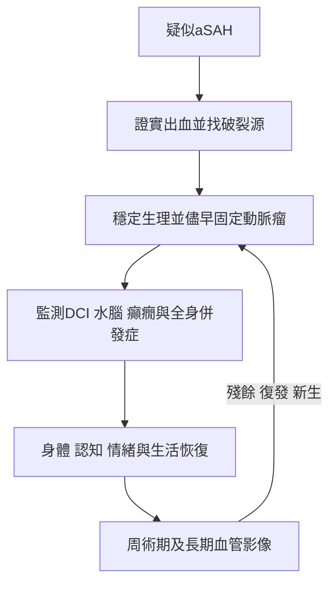

# 10. 復發 aSAH 的危險因子、預防與後續監測

## 推薦表（e350）

| COR | LOE | 建議 |
|---|---|---|
| 1 | B-NR | aSAH 接受動脈瘤修復後，應做周術期腦血管影像，以辨認可能需進一步治療的殘餘或復發。 |
| 1 | B-NR | 修復後應做後續腦血管影像，以辨認已治療動脈瘤的復發／再生長、其他已知動脈瘤的變化，或新生動脈瘤；必要時再治療以降低 aSAH 風險。 |

## 綜述（e351）

aSAH 動脈瘤修復後應做周術期影像，尋找可能導致再出血的殘餘或復發。ISAT 等大型 RCT 雖評估再出血，但只有血管內治療被要求術中／術後影像。Surgically clipped aneurysm 的術中及術後影像已有研究，但並非專門為判定破裂瘤再出血風險。本節建議建立在兩點：治療後確有再出血，以及對令人擔心的殘餘或復發預先再治療，可能防止再出血。

## 各項推薦的支持文字

### 1. 周術期影像回答「這次治療是否真正固定破裂源」

ISAT 中，治療後前 30 天 target aneurysm 再發 aSAH，endovascular 組 1.9%、surgical 組 0.6%。血管內組 20 名 30 天內再出血者中，5 人未放 coil、7 人封閉不完整、3 人被認為完全封閉、5 人因 thromboembolic complication 接受 thrombolytic therapy。由此可見，封閉不完整者短期再出血較高；周術期影像應評估可能需治療的殘餘或復發。

### 2. 延遲影像回答「治療是否耐久，以及其他血管是否產生新風險」

ISAT 中，target aneurysm 在治療後 30 天至 1 年再發 SAH，血管內與手術組分別 0.6% 與 0.4%；1-5 年均為 0%；超過 5 年為 0.5% 與 0.3%。血管內治療的長期復發，在封閉不完整及較大動脈瘤較多。

統合分析顯示，clipped aneurysm 若仍有 residual，regrowth risk 為每年 2.1%；無 residual 者每年 0.26%。因此，動脈瘤特別是未完整封閉者，長期可復發並可能再破裂。

除了 target aneurysm，再發 SAH 也可能來自其他已知、未知或 de novo aneurysm：前 12 個月 0%，1-5 年 0.3%，超過 5 年 0.3%。因此，延遲影像需同時檢視：

1. 已治療破裂動脈瘤的 residual、recurrence 或 regrowth；
2. 其他已知動脈瘤是否改變；
3. 過去未知或新形成的 de novo aneurysm。

## 表 5：再破裂與新生動脈瘤的危險因子

| 類別 | 特徵 | 風險解讀 |
|---|---|---|
| 再破裂 | Residual aneurysm | 封閉不完整提高再破裂；即使完全封閉，長期風險仍非零。 |
| 再破裂 | Coiled aneurysm | Coiling 的不完全封閉與 recurrence 較多，因此再破裂風險較高。 |
| De novo 形成 | 年輕、家族史、多發動脈瘤 | 這些特徵增加新動脈瘤形成風險。 |
| De novo 生長／破裂 | 女性、形成間隔較短、多發、較大 | 這些特徵增加新生動脈瘤生長與破裂風險。 |

### 表格闡釋

表 5 不是在說 coiling 不應使用，而是在說**治療方式會改變追蹤風險結構**。Coiling 常有較高殘餘或復發機率，因此更依賴影像追蹤；clipping 通常較耐久，但只要仍有 residual，風險同樣顯著。另一方面，de novo aneurysm 不是原治療失敗，而是病人的整體血管易感性在時間中繼續表現。

## 知識缺口

### 影像追蹤是否改善結果

ISAT 等大型試驗證實治療後仍可能再出血，也存在較易再破裂的不完整治療動脈瘤；但術後影像究竟如何改變再次治療與再出血風險，直接資料有限。

### 追蹤時機與持續期間

治療後超過 5 年，原破裂動脈瘤造成再發 SAH 的風險仍非零；然而，後續影像最佳時點、間隔與追蹤多久，仍不清楚。

## 全文最後的決策閉環

全文最後不是停在「動脈瘤已經處理」，而是建立一個時間上的循環：**急性期消除迫近的再破裂，住院期阻止次級腦傷，恢復期辨認看不見的失能，長期再以影像監測治療是否耐久及新的血管風險。**

