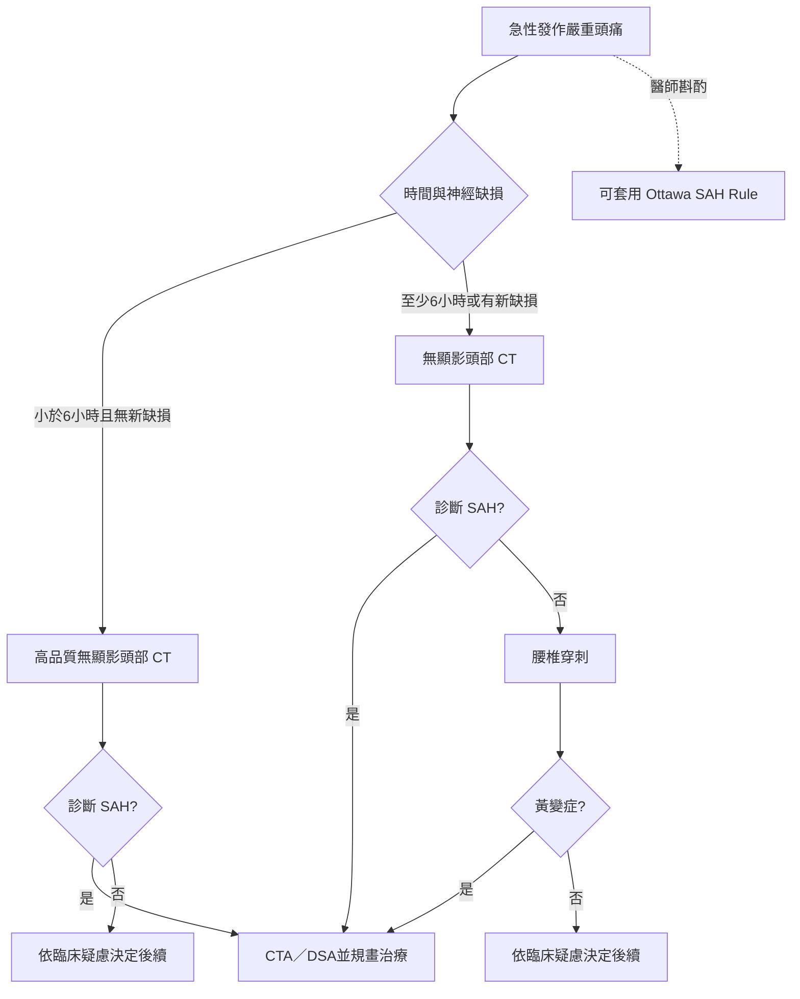
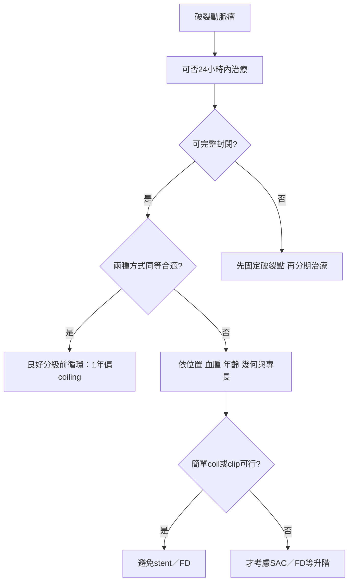
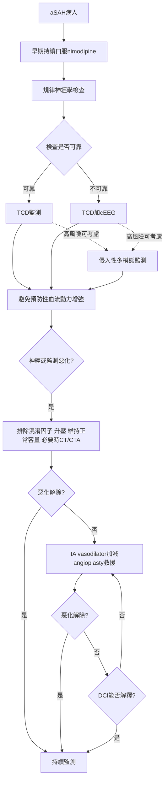
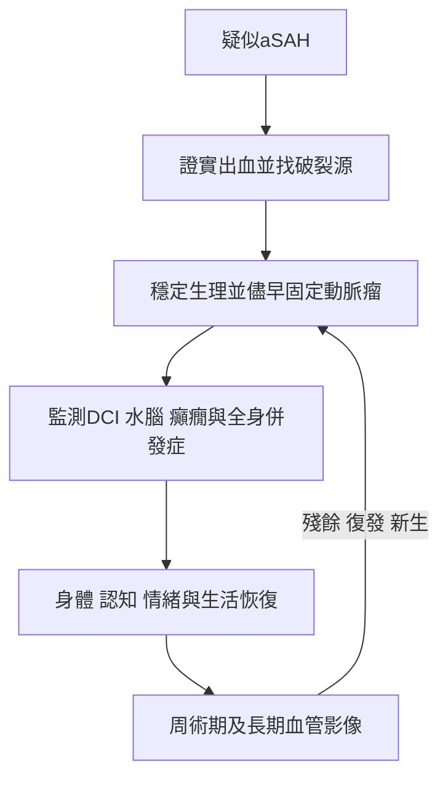

# 摘要、十大重點與前言

## 標題與文件定位（e314）

**2023 年動脈瘤性蜘蛛膜下腔出血病人處置指引：美國心臟協會／美國中風協會指引**

美國神經學學會確認，本聲明可作為神經科醫師的教育工具。美國神經外科醫學會／神經外科醫師大會之腦血管分會亦確認本文件的教育價值。本指引並獲神經重症照護學會、神經介入外科學會，以及血管與介入神經學學會背書。

## 摘要（e314）

### 目的

《2023 年動脈瘤性蜘蛛膜下腔出血病人處置指引》取代 2012 年版指引。新版旨在提供以病人為中心的建議，協助臨床醫師預防、診斷與處置動脈瘤性蜘蛛膜下腔出血（aneurysmal subarachnoid hemorrhage, aSAH）。

### 方法

寫作小組在 2022 年 3 月至 6 月間，全面搜尋 2012 年版指引之後發表的文獻；納入資料以人類研究、英文發表，且收錄於 MEDLINE、PubMed、Cochrane Library 與其他相關資料庫者為主。小組也檢視 AHA 先前發布的相關文件。若 2022 年 7 月至 11 月間的新研究會影響推薦內容、推薦等級（COR）或證據等級（LOE），亦酌情納入。

### 結構

aSAH 是全球重要的公共衛生威脅，具有高度失能與死亡風險。本指引依現有證據提出治療建議，形成從預防、診斷到處置的實證路徑；目的在提升照護品質，並使決策符合病人及其家屬與照顧者的利益。許多舊版建議已依新證據更新；有足夠已發表資料支持時，也新增了建議。

### 關鍵詞

AHA 科學聲明、血腫、顱內動脈瘤、顱內出血、動脈瘤性蜘蛛膜下腔出血、血管痙攣。

------------------------------------------------------------------------

## 十大帶回訊息（e315-e316）

### 1. 照護地點本身就是治療的一部分

若要改善整體預後，必須讓病人及時且公平地取得完整型中風中心等醫療資源。在具有專責神經重症單位、較高病例量、動脈瘤治療專家、專業護理與跨專科團隊的中心治療 aSAH，與較低死亡率及較高良好功能預後機率相關。因此，建議及時轉送至具 aSAH 專業能力的中心。

\*\*闡釋：\*\*這不是單純的行政建議。aSAH 的風險同時來自再出血、腦壓、水腦、呼吸循環失衡與延遲性腦缺血；只有把手術、介入、神經重症與護理偵測放在同一系統，才能縮短每次惡化到處置之間的延遲。

### 2. 破裂源應盡快處理，目標是完整封閉

aSAH 後急性再出血會增加死亡與不良臨床預後。建議迅速評估、確認動脈瘤來源並治療破裂動脈瘤，最好在 24 小時內完成。只要技術上可行，治療目標應為完全封閉，以降低再出血及再次治療的風險。

**闡釋：**「24 小時內」回答何時做；「完全封閉」回答做到什麼程度。兩者都不是在回答要用 clip 還是 coil。

### 3. 封閉動脈瘤與介入風險必須同時衡量

如何在「固定破裂源」與「治療本身的風險」之間取得平衡，取決於病人及動脈瘤特徵，應由兼具血管內與外科治療專業的醫師判斷。成熟的分級量表有助於預後判斷，也能支持病人、家屬或代理人共同決策。

\*\*闡釋：\*\*治療方式並不是由單一影像特徵自動決定。年齡、臨床分級、血腫、動脈瘤位置與形態、分支血管、耐久性，以及中心經驗會共同改變淨效益。

### 4. 全身性照護會改變神經學預後

多器官內科併發症與較差預後相關。對使用呼吸器者，建議採用標準加護照護組合，並執行靜脈血栓栓塞預防。密切血流動力監測，以及降低血壓變異的血壓管理具有益處。容量治療應以目標導向維持正常血容量；高血容量本身會增加傷害，應避免。常規使用抗纖維蛋白溶解治療並未改善功能預後。

### 5. 癲癇用藥不是一律預防，而是依風險分層

aSAH 後若新發癲癇，建議以抗癲癇藥治療 7 天。不應常規給所有病人預防性抗癲癇藥，但高風險者可考慮使用，包括破裂中大腦動脈瘤、腦實質內出血、高分級 aSAH、水腦或皮質梗塞。Phenytoin 與額外病害相關，應避免。連續腦波可偵測非痙攣性癲癇，尤其適用於意識低下或神經學檢查波動者。

### 6. 延遲性腦缺血需要「連續偵測」，不是一次檢查

延遲性腦缺血（delayed cerebral ischemia, DCI）仍是重要併發症，並與較差預後相關。臨床惡化的監測仰賴受過訓練的護理人員快速辨識神經學變化。經顱都卜勒、電腦斷層血管攝影及電腦斷層灌流若由有經驗者執行與判讀，可協助發現腦血管痙攣並預測 DCI。對高分級 aSAH、臨床神經檢查受限者，連續腦波與侵入性監測亦可能有用。

\*\*闡釋：\*\*血管痙攣是可觀察到的血管現象，DCI 是臨床腦缺血結果；兩者高度相關但不能畫上等號。因此，監測策略必須把床邊變化、血流速度、血管影像與灌流資訊接在一起。

### 7. Nimodipine 應早期使用；statin 與靜脈鎂不應常規使用

早期開始腸道給予 nimodipine，可預防 DCI 並改善 aSAH 後功能預後。不建議常規使用 statin 或靜脈注射 magnesium。

### 8. 有症狀 DCI 才升壓；不要預防性製造高血容量

對已出現症狀性 DCI 的病人，升高血壓並維持正常血容量，可能減少 DCI 的進展與嚴重度。然而，為避免醫源性風險，不應預防性增強血流動力或製造高血容量。

### 9. 動脈瘤治療完成，不等於追蹤結束

治療後的腦血管影像及後續影像監測，可用於規畫殘餘、復發或再生長動脈瘤的治療，也能辨識其他已知動脈瘤的變化。雖然再破裂風險低，仍建議以影像引導可能降低未來 aSAH 風險的決策，尤其是仍有殘餘動脈瘤者。年輕、多發動脈瘤，或有至少兩名一等親曾罹患 aSAH 的病人，也應重視新生動脈瘤的影像監測。

### 10. 存活不是唯一終點

建議以跨專科團隊辨識出院需求並設計復健。aSAH 存活者常有持續的身體、認知、行為與生活品質缺損。早期使用經驗證的篩檢工具，可辨識這些問題，尤其是行為及認知障礙。處理情緒疾患可能改善長期預後；向病人說明長期認知功能障礙風險，也可能有益。

------------------------------------------------------------------------

## 前言（e316）

自 1990 年起，AHA／ASA 持續把科學證據轉譯為臨床實務指引，以建議改善腦血管健康。這些指引以系統性方法評估及分類證據，為高品質腦血管照護提供基礎。指引的發展與出版不接受商業贊助，成員以志願方式投入撰寫與審查。

中風臨床指引的建議，適用於已罹患或有風險發生腦血管疾病者。文件主要聚焦美國醫療實務，但許多內容亦適用於全球。指引可能被監管機關或支付者拿來參考，但核心目的仍是提升照護品質並符合病人利益。指引界定的是「多數、而非所有情境」所需要的做法，不能取代臨床判斷；每項建議都必須放回個別病人的價值、偏好與共病脈絡中考慮。

AHA／ASA 透過遴選不同背景的專家，使指引小組兼具必要專業並能代表更廣泛的醫療社群；其差異涵蓋性別、種族、族群、觀點、地理區域與臨床範疇，也邀請具相關利益與專業的組織共同背書。AHA／ASA 設有嚴格的指引發展政策與方法，以限制偏誤並防止不當影響。

自 2017 年起，AHA／ASA 對指引格式進行多項調整，使其更精簡且容易使用。新版採「模組化知識區塊」：每一區塊包含推薦表、簡短綜述、各推薦的支持文字，必要時另附流程圖或表格；並以超連結連接參考文獻，方便快速查閱。部分章節也加入「知識缺口與未來研究」，以及收錄有用但非核心圖表的線上資料補充。

## 本段核心

這份指引並不是一本把所有病人壓進同一流程的規則書。它先用證據建立可共享的秩序，再把最後一哩交還給臨床判斷：**推薦提供基準，病人的解剖、病程與價值則決定如何偏離基準。**

# 1. 導論

## 1.0 疾病負擔（e316-e317）

動脈瘤性蜘蛛膜下腔出血（aSAH）是全球重要的公共衛生威脅。全世界整體發生率約為每 10 萬人年 6.1 例，全球盛行病例估計為 809 萬例（95% 不確定區間 702-972 萬）。然而，各地區差異很大：日本與芬蘭的發生率最高，分別為每 10 萬人年 28 例與 16.6 例；年齡標準化盛行率則以日本與安地斯拉丁美洲最高。

不同地區的長期趨勢也高度異質。1955 至 2014 年間，全球 aSAH 發生率平均每年下降 1.7%，北美每年下降 0.7%；2010 至 2020 年全球年齡標準化盛行率下降 0.81%（95% 不確定區間 -1.91% 至 0.26%）。相反地，美國在 2007 至 2017 年間的發生率卻上升至每 10 萬人年 11.4 例。

aSAH 具有高度失能與死亡風險。院前死亡率為 22%-26%。住院死亡率並未明顯改善：美國由 2006 年的 13.7% 降至 2018 年的 13.1%，2021 年全球資料則約 19%-20%。不過，人口型研究顯示，1980 至 2020 年整體病例致死率每年下降約 1.5%，但國家間差異很大。2020 年估計的 SAH 年齡標準化死亡率，以大洋洲、安地斯拉丁美洲與中亞最高。

隨人口老化，aSAH 的公共衛生負擔可能進一步上升。發生率隨年齡增加，特別是 55 歲以上女性。女性相對於男性的相對風險約為 1.3。美國資料亦顯示，黑人病人的 aSAH 發生率不成比例地偏高，而且仍在上升。

因此，即使整體發生率與盛行率看似下降，仍有特定族群承受上升的風險。院前及住院死亡率長期偏高，加上老年人口中的病例增加，都要求更好的治療與實務標準。現有死亡率可能仍低估疾病總負擔，因為尚未計入生產力損失與存活者的長期失能。

上一版 AHA／ASA aSAH 指引發布於 2012 年。此後，aSAH 治療知識與資料已有重要進展；2023 年版因此要把新證據轉化為可實際使用的臨床建議。

## 1.1 方法與證據回顧（e317）

本指引的建議在可能範圍內均以證據為基礎，並經廣泛文獻審查。寫作小組於 2022 年 3 月至 6 月搜尋 2012 年版之後的研究，以人類研究、英文發表，且收錄於 MEDLINE、PubMed、Cochrane Library 與其他相關資料庫者為主；同時回顧 AHA 先前發布的相關文件。2022 年 7 月至 2023 年 1 月間若有研究會改變推薦內容、COR 或 LOE，也酌情納入。

各節推薦表所依據的研究資料，收錄於本指引的線上資料補充，其中包括寫作小組形成建議時使用的證據表與搜尋詞。AHA／ASA 的方法學不鼓勵在「知識缺口與未來研究」段落放入引文，目的在讓焦點停留於仍缺乏的資訊與尚未解答的問題，而不是已完成的研究。

每一節均指定主要作者與主要審查者，部分主題另有次要作者與審查者。分工依小組成員專長，以及其與該節內容相關產業關係的缺乏而決定。所有建議均由全體寫作小組審查、討論並納入多元觀點，之後投票，並以修正式 Delphi 程序達成共識。若成員與特定議題的產業有關係，便迴避該項投票。所有建議均獲 80.9%-100% 具投票權成員同意。

## 1.2 指引寫作小組的組成（e317）

aSAH 寫作小組包含神經重症、血管神經、腦血管神經外科、不同背景的神經介入專家（放射、神經科與神經外科）、麻醉醫師、復健與中風恢復醫師、急性照護專科護理師、受訓中的研究員，以及一般民眾／病人代表。成員來自 AHA／ASA、美國神經外科醫學會／神經外科醫師大會、美國神經學學會、神經重症照護學會、神經介入外科學會及血管與介入神經學學會。附錄 1 列出相關產業與其他機構關係；完整揭露資訊另於網路公開。

## 1.3 文件審查與核准（e317-e318）

本文件經 AHA 中風委員會科學聲明監督委員會、AHA 科學諮詢與協調委員會、AHA 執行委員會、各共同參與學會的審查者，以及 39 名個別內容審查者審閱。審查者完整揭露資訊列於附錄 2。

## 1.4 指引範圍（e318）

本指引處理成人 aSAH 的診斷與治療，更新並取代 2012 年 AHA／ASA aSAH 指引。範圍明確限於 aSAH，不處理外傷、血管畸形或易出血腫瘤所造成的其他 SAH，也不與 AHA／ASA 對腦內出血、動靜脈畸形及未破裂顱內動脈瘤的指引或科學聲明重疊。

本指引涵蓋 aSAH 的完整病程：由初始診斷（第 4 節）、照護系統（第 5 節）、急性介入（第 6、7 與 7.1 節），延伸至住院期間併發症照護（第 8-8.5 節）。2023 年版新增護理照護（第 8.1 節）與恢復（第 9 節），並討論 aSAH 復發風險因子（第 10 節）。動脈瘤形成、破裂的風險，以及未破裂動脈瘤處置則不在本指引範圍，因已有獨立指引處理。新版特別強調共同決策、健康公平與照護系統。

aSAH 的部分住院內科照護、復健與恢復，可能與其他中風類型相似；重疊議題應參閱其他 AHA／ASA 指引與科學聲明。

### 圖 1：aSAH 病人的照護連續體

圖的上層把照護場域排成五站：**院前 → 急診 → 急性住院 → 急性後照護 → 門診**。中層則不是依地點，而是依病理時間分為三個彼此重疊的階段：

| 階段         | 原圖列出的工作                                                 | 臨床意義                                                                     |
|--------------|----------------------------------------------------------------|------------------------------------------------------------------------------|
| 早期腦損傷   | 急救、急診診斷、防再出血、治療水腦、處理升高 ICP、處理癲癇     | 首要目標是維持生命並封住破裂源；任何延遲都可能讓第一次出血變成再出血或疝脫。 |
| 延遲性腦損傷 | DCI、鈉失調、全身併發症、發燒與溫度、血糖、營養                | 動脈瘤已固定不等於危險結束；病人可能因次級傷害在數日後惡化。                 |
| 恢復         | 早期復健、頭痛與癲癇處理、動脈瘤監測、認知與情緒篩檢、長期預後 | 最終結果不只看 mRS 或是否存活，也要看認知、情緒、功能與再發風險。            |

圖的底層把病人、家屬與照顧者置於中心；左側是健康公平、共同決策與教育，右側是完整型中心、照護系統與跨專科團隊。這表示 aSAH 照護有兩種同時存在的邏輯：**時間敏感的醫療路徑**與**以病人價值為核心的決策路徑**。

### 表 1：相關 AHA／ASA 文件

| 主題                 | 發布年 | 與本指引的邊界                                       |
|----------------------|-------:|------------------------------------------------------|
| 自發性腦內出血處置   |   2022 | 若主要問題是 ICH 本身，應回到 ICH 指引。             |
| 未破裂顱內動脈瘤處置 |   2015 | 未破裂瘤的篩檢、自然病史與預防性治療不由本指引回答。 |
| aSAH 處置            |   2012 | 為本版所取代的前一版。                               |
| aSAH 處置聲明        |   2009 | 更早期文件，供歷史比較。                             |
| 腦動靜脈畸形處置     |   2017 | AVM 所致 SAH 不屬 aSAH 指引範圍。                    |

## 1.5 推薦等級與證據等級（e319）

每項建議同時標示 COR 與 LOE。COR 表示推薦強度，綜合考量相對於風險的預期獲益幅度與確定性；LOE 則依臨床試驗與其他來源資料的研究類型、數量及一致性，評定支持該介入的科學證據品質。

### COR／LOE 應如何讀

- **COR 1（強）**：獲益明顯大於風險，應執行。
- **COR 2a（中等）**：獲益大於風險，採取該作法是合理的。
- **COR 2b（弱）**：獲益至少不小於風險，可考慮。
- **COR 3：無益**：證據顯示沒有幫助，不應常規執行。
- **COR 3：有害**：風險大於獲益，不應執行。
- **LOE A**：一個以上高品質 RCT、其統合分析，或由高品質登錄研究確認的 RCT 證據。
- **LOE B-R**：中等品質隨機證據。
- **LOE B-NR**：中等品質非隨機、觀察性或登錄研究證據。
- **LOE C-LD**：有限資料。
- **LOE C-EO**：專家意見。

\*\*關鍵解讀：\*\*COR 與 LOE 不可混為一談。臨床上某些急迫、幾乎不可能再做 RCT 的處置，即使只有 C-EO，也可能因獲益風險極不對稱而成為 COR 1。

## 1.6 縮寫（e319）

| 縮寫           | 中文                                      |
|----------------|-------------------------------------------|
| AHA / ASA      | 美國心臟協會／美國中風協會                |
| ARDS           | 急性呼吸窘迫症候群                        |
| aSAH / SAH     | 動脈瘤性蜘蛛膜下腔出血／蜘蛛膜下腔出血    |
| BP             | 血壓                                      |
| CBF            | 腦血流                                    |
| cEEG / EEG     | 連續腦波／腦波                            |
| COR / LOE      | 推薦等級／證據等級                        |
| CSF            | 腦脊髓液                                  |
| CT / CTA / CTP | 電腦斷層／CT 血管攝影／CT 灌流            |
| DCI            | 延遲性腦缺血                              |
| DSA            | 數位減影血管攝影                          |
| EVD            | 腦室外引流                                |
| GCS            | 格拉斯哥昏迷量表                          |
| GWG            | 指引寫作小組                              |
| HH / WFNS      | Hunt and Hess／世界神經外科醫學會聯盟分級 |
| ICH / ICP      | 腦內出血／顱內壓                          |
| ICU            | 加護病房                                  |
| LP             | 腰椎穿刺                                  |
| MCA            | 中大腦動脈                                |
| MMSE / MoCA    | 簡易智能狀態檢查／蒙特婁認知評估          |
| mRS / NIHSS    | 改良 Rankin 量表／NIH 中風量表            |
| QOL            | 生活品質                                  |
| RCT / RR       | 隨機對照試驗／相對風險                    |
| TCD            | 經顱都卜勒                                |
| TTM            | 目標溫度管理                              |
| VTE            | 靜脈血栓栓塞                              |

# 2. 一般概念

## 2.1 疾病的重要性（e319-e320）

aSAH 是破壞性極高的疾病。約 13% 病人會在住院期間死亡，最多 26% 在抵達醫院前死亡。不同於其他中風亞型，aSAH 常發生於仍在工作年齡的人，平均年齡約 55 歲。

腦動脈瘤與 aSAH 的成因可能是多因性的；高血壓與吸菸是重要、可改變的危險因子。家族史少見但重要：若至少兩名一等親已知有腦動脈瘤，本人帶有腦動脈瘤的盛行率約 12%。對 20-80 歲且至少兩名一等親有腦動脈瘤者，每 5-7 年進行一次影像篩檢具有成本效益。

aSAH 的社會經濟成本相當可觀。美國每名 aSAH 病人的住院費用曾報告為 373,353.94 美元；若發生 DCI，可高達 530,544.77 美元。這些數字尚未納入住院後長期照護、復健，以及無法工作與生產力損失造成的社會成本。

## 2.2 aSAH 後損傷機轉（e320-e321）

過去十年的臨床與轉譯研究，包括隨機試驗，使我們逐漸理解：aSAH 相關腦損傷不是單一事件，而是**多階段、多機轉**的過程。出血後前 72 小時內促成早期腦損傷的病理生理，也會影響後續併發症與整體預後。

目前認為 DCI 並非只由大血管痙攣造成，而是大血管痙攣與「動脈瘤破裂／早期腦損傷所啟動的多種腦傷害過程」共同作用的結果。可能機轉包括：

- 小動脈收縮與腦內微血栓；
- 皮質擴散性去極化／缺血；
- 血腦障壁破壞；
- 腦自動調節失常；
- 微血管通過時間異質性。

這些機轉可能共同參與 DCI 與 DCI 相關腦梗塞。神經發炎可能獨立發生，也可能是早期腦損傷的結果，目前被視為潛在介入標的。

以血管內栓塞或神經外科夾閉早期修復破裂動脈瘤、預防再出血，已降低病例致死率。在專責神經 ICU，由跨專業團隊處理腦水腫、水腦、ICP 升高、DCI 與內科併發症，也很可能改善急性期預後。然而，認知恢復、情緒疾患與生活品質方面的慢性病害證據正在增加。

因此，本指引同時指出幾個研究方向：改善損傷與預後預測的生物標記；辨認存活者對延遲併發症的長期追蹤需求；並在整個照護連續體中，以共同決策納入病人中心的結果指標。

### 機轉圖的真正意義

若把 aSAH 想成「血管破掉 → 血管痙攣 → 梗塞」，就會錯過大部分可介入的層次。較正確的模型是：

1.  **破裂的瞬間**造成 ICP 急升、灌流下降與全腦性應激；
2.  **早期腦損傷**改變自動調節、血腦障壁、微循環與發炎；
3.  **數日後**大血管痙攣、微血栓與去極化等機轉疊加，才產生 DCI；
4.  **長期結果**再受到全身併發症、復健、認知與情緒因素調節。

所以，血管影像上的痙攣既不是 DCI 的充分條件，也不是唯一可治療標的。

## 2.3 可推廣性（e321）

本指引多數證據來自高資源國家，研究族群可能在族群、種族與社經層級上相對同質。因此，將建議套用到資源較少的環境時，可推廣性可能受限；這也凸顯臨床服務不足地區與代表性不足族群仍需要更多研究。

## 本章核心

aSAH 的秩序不是「找到一條壞掉的血管」而已，而是辨認一個跨越血管、微循環、腦壓、全身生理與長期功能的動態系統。**封閉動脈瘤消除了再次破裂的來源，卻沒有自動終止已被啟動的腦損傷。**

# 3. aSAH 的自然病史與預後

## 推薦表（e321-e322）

| COR     | LOE  | 建議                                                                                       |
|---------|------|--------------------------------------------------------------------------------------------|
| 1       | B-NR | aSAH 病人應使用臨床量表，例如 Hunt and Hess（HH）或 WFNS 分級，判定初始嚴重度並預測預後。  |
| 2a      | B-NR | 高分級 aSAH 病人在與家屬審慎討論可能預後後，進行動脈瘤治療是合理的，可望改善結果。         |
| 2a      | B-NR | 高齡 aSAH 病人在與家屬審慎討論預後後，進行動脈瘤治療是合理的，可改善存活與結果。           |
| 3：無益 | B-NR | 若病人經可逆因素矯正後仍未改善，並因已有不可逆神經損傷而判定無法挽救，治療動脈瘤沒有益處。 |

## 綜述

若要改善 aSAH 預後，必須迅速完成臨床評估、動脈瘤治療與相關併發症處置。成熟分級量表可作為臨床預後指標。高分級 SAH 病人只要沒有不可恢復且毀滅性的神經損傷，仍可能是動脈瘤治療候選者。高齡病人則需更審慎評估，並與家屬或代理決策者共同討論預後與治療。

## 各項推薦的支持文字

### 1. 分級量表用來校準起點，不是宣判結局

多項研究已確認 HH 與 WFNS 等臨床分級可預測結果。其他系統包括 Yasargil 分級、GCS 與 Johns Hopkins GCS 分級。近年也把影像分級（如 Fisher）與臨床分級組合成複合分數，例如 VASOGRADE、HAIR（HH、年齡、腦室內出血、再出血）、SAHIT 與 SAH score。這些量表可預測臨床結果，並協助醫療團隊以一致方式描述出血嚴重度。

\*\*闡釋：\*\*量表的功能是標準化病人狀態與群體風險，不是以某一分數取代可逆原因排除、治療反應及個別價值判斷。

### 2. 高分級不等於不治療

高分級 aSAH 的處置極具挑戰。多數文獻將 HH 4-5 或 WFNS 4-5 定義為高分級。治療動脈瘤雖可預防再破裂，但必須依共病、出血前功能等病人因素個別化，並與家屬或代理人共同決策。Mocco 等人的研究中，98 名接受治療的 HH 4-5 病人有 40% 在 12 個月達良好結果；另一篇納入 85 項研究、4506 名低分級狀況不佳病人的統合分析中，接受治療者有 39% 結果良好。

### 3. 高齡降低機率，但不抹除可能性

控制神經損傷程度後，高齡 aSAH 病人的結果仍較年輕者差。BRAT 試驗 405 人的事後分析顯示，65 歲以上病人在 6 年追蹤時有 42% 達功能獨立，雖顯著低於年輕組的 82%，仍證明此年齡層接受動脈瘤治療是合理選項，應在與家屬及代理人討論後考慮。

### 4. 只有在不可逆損傷被充分證實後，治療才可能無益

少數高分級 aSAH 病人已有不可恢復腦傷，預後差到治療動脈瘤不會帶來益處。可能表現包括部分或完全腦幹反射消失、對傷害刺激無目的性反應、入院 CT 已見大範圍完成性缺血梗塞，或符合缺氧性腦傷的瀰漫性腦水腫。

但應先及早找出可逆內科因素，因為這些病人的結果明顯較好。可逆因素包括癲癇、水腦、低血鈉等電解質異常、癲癇重積與低體溫。各項指標還有時間與情境差異：到院時無腦幹反射，意義低於 12 或 24 小時後仍無反射；早期 CT 可能尚難辨識腦水腫；ICP 可能很高卻無腦室擴大；處理水腫與腫塊效應後的反應也會改變判斷。因此，專家跨科別的內科與重症照護極為重要。

## 知識缺口與未來研究

- \*\*內科共病與參數：\*\*BMI、高血壓、高血糖、troponin、體溫過高、白血球峰值、CRP 與高中性球數均曾與結果相關，但其獨立預後價值及對治療結果的影響仍需研究。
- \*\*新型生物標記：\*\*影像、血清與 CSF 標記是活躍領域。未來需把蛋白體、基因體及其他生物標記，與既有臨床、影像及生理監測整合，判定其在預後與介入選擇上的用途。
- \*\*高齡：\*\*高齡是較差預後的額外危險因子，但尚無明確年齡切點，而且適當門檻很可能因人而異。
- \*\*急性復甦與早期 DNR：\*\*aSAH 尚未專門研究早期 DNR 與積極復甦對結果的差異。其他中風族群主張先積極復甦，將 DNR 延後最多 72 小時，以避免治療虛無主義。
- \*\*不可恢復的早期腦損傷：\*\*前述證據仍未被完整定義，尤其缺乏明確的時間軸與嚴重度門檻。

## 決策上的核心張力

這一章真正處理的不是「量表多少分要不要救」，而是：\*\*如何在不製造無效治療的同時，避免因早期混沌與可逆因素而過早放棄。\*\*高分級與高齡都改變成功機率；只有充分證實的不可逆損傷，才改變治療是否仍有意義。

# 4. aSAH 的臨床表現與診斷

## 推薦表（e322）

### 評估是否為 aSAH

| COR | LOE  | 建議                                                                                                                                    |
|-----|------|-----------------------------------------------------------------------------------------------------------------------------------------|
| 1   | B-NR | 急性發作的嚴重頭痛應迅速進行診斷檢查，以診斷或排除 aSAH，降低失能與死亡。                                                               |
| 1   | B-NR | 急性嚴重頭痛若在症狀發作超過 6 小時才就醫，或有新發神經缺損，應先做無顯影頭部 CT；若 CT 未見 aSAH，應做腰椎穿刺（LP）。                 |
| 2a  | B-NR | 發作 6 小時內就醫且無新發神經缺損者，以高品質掃描器完成、並由具專科認證的神經放射科醫師判讀之無顯影頭部 CT，可合理用於診斷或排除 aSAH。 |
| 2b  | B-NR | 急性嚴重頭痛且無新發神經缺損者，可考慮使用 Ottawa SAH Rule 辨認 aSAH 高風險病人。                                                       |

### 評估 SAH 的病因

| COR | LOE  | 建議                                                                                    |
|-----|------|-----------------------------------------------------------------------------------------|
| 1   | B-NR | 自發性 SAH 若高度懷疑動脈瘤來源，但 CTA 陰性或無法確定，應做 DSA 以診斷或排除腦動脈瘤。 |
| 2a  | B-NR | 已確認由腦動脈瘤造成的 SAH，可使用 DSA 判定最適當的介入策略。                           |

## 綜述（e323）

清醒病人的典型 aSAH 表現，是突然發作且立刻達到最大強度的頭痛。aSAH 主要發作前，10%-43% 病人曾出現警告性或哨兵頭痛。誤診或延遲診斷可能造成死亡或嚴重失能。無顯影頭部 CT 仍是診斷 SAH 的核心，但後續檢查取決於距離症狀發作的時間與病人的神經學狀態。醫師必須判斷某項檢查是否真會改變臨床處置。

## 圖 2：疑似 aSAH 病人的診斷流程

\*\*如何讀：\*\*6 小時不是把 CT 從「可用」變成「無用」的魔法切點，而是改變陰性 CT 後殘餘風險是否足以接受。若超過 6 小時或已有神經缺損，單靠陰性 CT 不足，需以 LP 補上對出血本身的偵測。CTA／DSA回答的是「破裂源在哪裡」，不等同直接證明 CSF 空間裡是否曾出血。

## 各項推薦的支持文字（e323-e324）

### 1. 必須先維持高度懷疑

有效處理 aSAH 及其併發症，前提是及時辨認與初步處置。aSAH 可致命，漏診會帶來顯著失能與死亡。臨床醫師必須對此診斷保持警覺，必要時完成適當檢查；若能在災難性破裂前辨認哨兵出血，可能挽救生命。

### 2. 超過 6 小時或 CT 不確定時，LP 仍有獨立價值

對不符合 Ottawa SAH Rule 適用條件者，需以頭部 CT，必要時再以 LP 檢查黃變症。LP 常於症狀發作後 6-12 小時以上進行。Walton 等人整合 3 項研究共 1235 人：陰性或無法診斷的 CT 後，以分光光度法分析 LP 所得 CSF 的黃變症，敏感度為 100%，特異度為 95.2%。

美國急診醫學會對「高度懷疑 SAH、但無顯影 CT 無法確定」者，建議下一步可做 CTA 或 LP，證據等級為 C。然而，尚無研究直接比較正常／無法診斷 CT 後，以 CTA 或 LP 作為下一步的策略。CTA 不直接評估 SAH，只看腦血管病變，整體敏感度約 97.2%；對小於 3 mm 的破裂動脈瘤，另一分析估計敏感度只有 61%。因漏診 aSAH 後果嚴重，這些小差異仍具關鍵意義。發作超過 6 小時且高度懷疑 SAH 者，應以 LP 檢查黃變症。

### 3. 六小時內 CT 策略有嚴格前提

高品質 CT 對 SAH 具有高敏感度，尤其影像由受過次專科訓練、具認證的神經放射科醫師判讀。若病人在頭痛發作 6 小時內到院且沒有新發神經缺損，無顯影頭部 CT 未見 SAH，通常足以排除 aSAH。

2016 年統合分析納入 8907 人，6 小時內 CT 共漏掉 13 例 SAH，敏感度 98.7%、特異度 99.9%；換算後，每 1000 例 SAH 漏診少於 1.5 例。但這些分析多不適用於非典型表現，例如以頸痛、暈厥、癲癇或新發局灶神經缺損為主。缺乏典型雷擊頭痛不應阻止適當影像與檢查。

### 4. Ottawa SAH Rule 是高敏感度、極低特異度的排除工具

Ottawa SAH Rule 用於篩出 aSAH 機率很低者。出現嚴重頭痛且符合表 3 任一條件者，可能需依醫師判斷進一步檢查。原始研究納入 2131 人，其中 132 人（6.2%）有 SAH；敏感度 100%，特異度僅 15.3%。後續由原作者在 6 個中心前瞻驗證 1153 人、67 例 SAH，敏感度仍為 100%，特異度 13.6%。外部驗證 454 人、9 例 SAH，敏感度 100%，特異度只剩 7.6%。因此，它只能讓一小群低風險病人避免更多影像與風險，不能用來「確診」。

### 表 3：Ottawa SAH Rule

適用於 **15 歲以上、意識清楚、新發非外傷性嚴重頭痛，且 1 小時內達最大強度**者。若有下列任一項，需進一步檢查：

1.  年齡至少 40 歲；
2.  頸痛或頸部僵硬；
3.  有人目擊意識喪失；
4.  運動或用力時發作；
5.  雷擊頭痛，即疼痛瞬間達高峰；
6.  檢查發現頸部前屈受限。

\*\*容易誤讀之處：\*\*這六項是「任一陽性就不能停」的條件，不是加總分數；而且只適用於特定頭痛族群。規則陽性很常見，並不表示病人很可能真的有 SAH。

### 5. 已見 SAH 後，CTA 陰性不一定結案

CTA 普遍可取得，無顯影 CT 診斷 SAH 後通常接著進行。不同出血分布對潛在動脈瘤的機率不同，例如瀰漫性基底池及 Sylvian fissure SAH，比少量局部皮質 SAH 更像動脈瘤來源。對瀰漫性 SAH，不論 CTA 結果如何，均應以 DSA 評估，因 CTA 空間解析度有限，小型動脈瘤或其他血管病變可能未被充分看見或描繪。

### 6. DSA 不只找瘤，也描繪治療幾何

DSA 是評估腦血管解剖與動脈瘤幾何的黃金標準，可協助選擇最適治療方式。在某些臨床情境，CTA 單獨也可支持治療決策。

## 知識缺口與未來研究

- \*\*MRI 的用途：\*\*仍需評估既有與新興 MRI 序列偵測及描述 aSAH 的診斷準確度。
- \*\*中腦周圍型 SAH：\*\*對此出血分布應只做 CTA，或仍需導管 DSA，目前仍無定論。
- \*\*新興技術：\*\*雙能量 CT 與光子計數 CT 可能有助於偵測 SAH 與動脈瘤。

## 本章核心

診斷鏈有兩個不能互相替代的問題：\*\*第一，蛛網膜下腔裡有沒有血？第二，血從哪一個血管病灶而來？\*\*CT／LP 主要回答前者，CTA／DSA主要回答後者。把 CTA 陰性當成「沒有出血」，或把找到偶發動脈瘤當成「它一定是破裂源」，都是跨層作答。

# 5. 醫院特性與照護系統

## 推薦表（e324）

| COR | LOE  | 建議                                                                                                                                                          |
|-----|------|---------------------------------------------------------------------------------------------------------------------------------------------------------------|
| 1   | B-NR | aSAH 病人應由病例量低的醫院及時轉送至病例量較高、具跨專業神經重症服務、完整型中風中心能力，以及有經驗的腦血管外科醫師／神經血管內介入醫師之中心，以改善結果。 |
| 1   | B-NR | aSAH 病人應由跨專業團隊在專責神經重症單位照護。                                                                                                               |

## 綜述（e325）

醫院資源與病例量是照護系統的重要條件。部分非隨機研究顯示，相較病例量較少的醫院，由有經驗的腦血管外科及血管內介入醫師，在 aSAH 病例量較大的醫院治療，並於專責神經重症單位照護，可降低死亡率。2012 年指引曾以每年超過 35 例作為較高病例量、少於 10 例作為較低病例量的例子。延遲轉送至具備上述能力的醫療機構，可能與較差結果相關。

## 各項推薦的支持文字

### 1. 高量中心的效益來自整個系統，而非單一數字

大型非隨機研究已描述醫院特性與照護系統對結果的影響，包括醫師專長、病例量及是否在專責神經重症單位照護。由於研究高度異質，很難定義高量與低量中心的精確病例門檻，因此推薦本身不列固定數字，只在綜述保留 2012 年指引的歷史門檻。

美國全國住院樣本與國際研究顯示，高量中心治療與較低院內死亡風險、較高良好功能結果機率相關。具中風中心認證也與較低 aSAH 院內死亡率相關。由於動脈瘤可能再破裂，之後又可能發生 DCI，病人能否及時抵達同時具動脈瘤治療及神經重症能力的醫院相當重要。

美國全國住院樣本顯示，aSAH 治療延誤相關因素包括高齡、非白人、Medicaid 支付身分、採外科夾閉，以及入住外科病例量低的醫院。這些因子提醒我們：「延誤」不完全由疾病嚴重度造成，也可能由制度與不平等製造。

### 2. 專責神經 ICU 與跨科團隊是可辨認的照護介入

研究結果主要以院內及出院後短期死亡率呈現，少數則提供更細緻指標，例如住院期間 DCI 比率，或由轉診醫院送往大型 aSAH 中心所需時間。過去 20 年 aSAH 病例致死率下降，可能來自內外科照護改善及神經重症單位興起。

PRINCE 研究涵蓋 47 國、257 個中心，顯示全球對神經急症病人的重症照護方式差異很大；疾病嚴重度與缺乏專責神經重症單位，都是死亡的獨立預測因子。

並非所有研究都發現病例量與較佳結果的關係。有一種解釋是：某些低量中心擁有高度專業的個別醫療人員，足以維持不劣的結果。另有 2001-2010 年美國全國住院資料分析顯示，教學醫院身分與較佳 aSAH 結果相關。

## 知識缺口與未來研究

### 年度監測與品質改善

aSAH 照護系統仍有許多不確定處。品質改善計畫是現代醫院照護的支柱，因此，每年監測 aSAH 外科與介入處置的併發症率，可合理視為標準實務；然而，這類計畫是否直接降低死亡與失能，資料仍少。單院病例量與病人結果的關係也仍具爭議，應持續研究。

### 病人特徵與健康不平等

不同醫院資源環境中的 aSAH 結果差異很大，可能涉及種族、基礎共病、社經因素、保險狀態、DNR 影響與治療可近性。支付者身分、保險類型、種族與族群、地方醫療系統組織，以及病人是經轉送或直接到可執行確定治療的醫院，都值得進一步檢視。

只有先辨認系統層級的不平等與照護可近性差異，才能把介入對準真正造成差距的位置。資源不足族群在災害中也常受到不成比例的衝擊，使不良健康結果進一步惡化。辨認隱性偏誤並訓練降低偏誤，可能有助改善中風照護不平等，值得研究。

### 指引遵從性

aSAH 尚未系統性研究指引遵從性與病人結果的關係。外傷性腦傷與缺血性中風資料則顯示，指引遵從程度越高，結果通常越好。

## 本章核心

「轉到高量中心」不是迷信數字，而是承認 aSAH 的結果由一連串需要即時銜接的能力共同決定：辨識惡化、穩定腦壓與全身生理、外科與介入雙向評估、24 小時內封閉破裂源，以及後續 DCI 監測。**病例量只是系統成熟度的代理指標，不是系統本身。**

# 6. aSAH 後預防再出血的內科措施

## 推薦表（e326）

| COR     | LOE  | 建議                                                                                             |
|---------|------|--------------------------------------------------------------------------------------------------|
| 1       | C-EO | 動脈瘤尚未固定的 aSAH 病人，應頻繁監測血壓，並以短效藥物控制，避免嚴重低血壓、高血壓與血壓變異。 |
| 1       | C-EO | 正在接受抗凝治療的 aSAH 病人，應以適當拮抗劑緊急逆轉抗凝，以預防再出血。                         |
| 3：無益 | A    | aSAH 病人常規使用抗纖維蛋白溶解治療，無法改善功能結果。                                          |

## 綜述

迅速封閉破裂動脈瘤，是目前唯一已證實能降低再出血機率的治療。超早期給予抗纖維蛋白溶解藥可能降低再出血，但各試驗結果不一致，而且未改善功能結果。因此，因缺乏整體臨床獲益，不建議常規使用。

臨床上在動脈瘤完成處置前常會控制高血壓，但早期降壓是否降低再出血風險，尚未明確建立。到院時處理嚴重高血壓是合理的，卻沒有足夠證據支持單一血壓目標；應避免突然且大幅降壓。對正在使用抗凝劑者，即使 aSAH 族群尚未直接研究逆轉效益，臨床判斷仍支持緊急逆轉。

## 各項推薦的支持文字

### 1. 血壓控制的目標是降低極端與波動，不是追逐唯一數字

血壓變異增加與較差 aSAH 結果相關；過度降壓則可能降低腦灌流並誘發缺血，尤其在 ICP 升高時。因此，寫作小組建議：嚴重高血壓（收縮壓 \>180-200 mmHg）時逐步降壓，同時嚴格避免低血壓（平均動脈壓 \<65 mmHg），並在降壓過程密切追蹤神經學檢查。

一篇早期再出血預測因子的統合分析顯示，收縮壓 \>160 mmHg 可能伴隨較高再出血率，而 \<140 mmHg 未見此關係；但可用觀察性研究很少，且結果異質。舊指引曾建議收縮壓低於 160 或 180 mmHg。這些值可作為實務參考，但證據不足以推薦任何單一目標。選擇降壓目標時，應同時考慮到院血壓、腦腫脹、水腦、既往高血壓與腎功能不全。

\*\*臨床翻譯：\*\*未固定動脈瘤前有兩個相反危險：過高與劇烈波動可能增加再出血；過低則降低 CPP。若已知 ICP，CPP = MAP - ICP 會比孤立的收縮壓更接近真正需要維持的生理量。

### 2. 抗凝逆轉的推薦是由相鄰證據支持

aSAH 尚未直接驗證緊急逆轉抗凝的效益，但其他顱內出血已證實立即逆轉的價值。因此，任何使用抗凝劑且發生 aSAH 的病人都強烈建議立即逆轉；策略應遵循當前對危及生命出血的標準。

### 3. Tranexamic acid 可能略減再出血，卻沒有改善病人真正重視的結果

最大型、高品質的超早期短期抗纖溶 RCT 為 ULTRA。Tranexamic acid 組從發作後中位 185 分鐘開始用藥，持續至動脈瘤固定，最長 24 小時。相較未接受抗纖溶治療者，試驗未顯著降低再出血，也未改善功能結果。

6 個月良好功能結果（mRS 0-3）在 tranexamic acid 組為 287/475（60%），控制組為 300/470（64%）；優良結果（mRS 0-2）在 tranexamic acid 組反而較低。再出血率分別為 10% 與 14%。較早研究對減少再出血的結果互相衝突，也都未顯著改善功能。因此，現有證據不支持常規用於 aSAH。

## 知識缺口與未來研究（e326-e327）

### 抗纖溶治療

ULTRA 有力顯示：若破裂動脈瘤能早期封閉（試驗中自症狀發作至封閉的中位時間為 14 小時），tranexamic acid 不會顯著減少再出血，也不改善功能。不過，若病人因物流或醫療因素將長時間延遲動脈瘤治療，極短療程抗纖溶是否仍有角色，尚未排除。

### 血壓治療

需要研究病人到院至動脈瘤封閉間的最適血壓管理。未來試驗應審慎決定治療目標要採收縮壓切點、平均動脈壓，或相對降幅以降低血壓變異。監測方式（侵入／非侵入）、降壓方式（間歇 bolus／持續輸注）的個別化，以及已知 ICP 時如何最佳化 CPP，也值得研究。

### 抗血栓藥影響

部分證據提示 aspirin 可能增加再出血風險，因此可研究：正在使用抗血小板藥而發生 aSAH 的病人，改善血小板功能的治療是否有益。無論一般 aSAH 或需開放手術者，血小板輸注的利弊證據皆有限；若進行試驗，必須納入 ICH 病人已知的安全疑慮。

### CSF 引流影響

破裂動脈瘤治療前進行 CSF 引流是否增加再出血，文獻結果矛盾。若必須引流，最適 EVD 管理策略仍需研究。

## 本章核心

內科措施是在等待確定治療時降低風險，卻不能取代封閉動脈瘤。血壓控制、逆轉抗凝與可能的暫時措施，都圍繞同一張力：**既要降低再破裂的機械與凝血風險，又不能犧牲已受威脅的腦灌流。**

# 7. 破裂腦動脈瘤之外科與血管內治療

## 7.0 推薦表（e327-e328）

### 治療時機

| COR | LOE  | 建議                                                                                                |
|-----|------|-----------------------------------------------------------------------------------------------------|
| 1   | B-NR | aSAH 病人的破裂動脈瘤應在到院後儘早以外科或血管內方式治療，最好於發作後 24 小時內完成，以改善結果。 |

### 治療目標

| COR | LOE  | 建議                                                                                                                      |
|-----|------|---------------------------------------------------------------------------------------------------------------------------|
| 1   | B-NR | 只要可行，應完整封閉破裂動脈瘤，以降低再出血及再次治療風險。                                                              |
| 2a  | C-EO | 若急性期無法以夾閉或 primary coiling 完整封閉，可合理先部分封閉並固定推定破裂點；功能恢復者再延後完成治療，以預防再出血。 |

### 治療方式：一般原則

| COR | LOE  | 建議                                                                                     |
|-----|------|------------------------------------------------------------------------------------------|
| 1   | B-R  | 後循環破裂動脈瘤若適合 coiling，應優先於 clipping，以改善結果。                          |
| 1   | B-R  | 可挽救的 aSAH 病人若因大型腦實質內血腫而意識下降，應緊急清除血腫，以降低死亡率。         |
| 1   | C-EO | 破裂動脈瘤應由具血管內與外科專長的專家評估，依病人及動脈瘤特徵比較兩類治療的風險與獲益。 |
| 2b  | B-R  | 70 歲以上 aSAH 病人，coiling 或 clipping 何者較能改善結果，尚未確立。                    |
| 2b  | C-LD | 40 歲以下 aSAH 病人，可考慮以 clipping 為優先，以提高治療耐久性與結果。                  |

### 同時適合 clipping 與 coiling 的動脈瘤

| COR | LOE | 建議                                                                                                                        |
|-----|-----|-----------------------------------------------------------------------------------------------------------------------------|
| 1   | A   | 良好分級、前循環破裂動脈瘤，且 **同等適合 primary coiling 與 clipping** 者，為改善 1 年功能結果，建議優先 primary coiling。 |
| 2a  | B-R | 同一族群若著眼於良好長期結果，兩種方式均屬合理。                                                                            |

### 血管內輔助裝置

| COR     | LOE  | 建議                                                                                                                      |
|---------|------|---------------------------------------------------------------------------------------------------------------------------|
| 2a      | C-LD | 破裂寬頸動脈瘤若不適合外科夾閉或 primary coiling，以 stent-assisted coiling 或 flow diverter 治療是合理的，可降低再出血。 |
| 2a      | C-LD | 破裂 fusiform／blister 動脈瘤使用 flow diverter 是合理的，可降低死亡。                                                    |
| 3：有害 | B-NR | 破裂囊狀動脈瘤若可用 primary coiling 或 clipping 治療，不應使用 stent 或 flow diverter，以避免更高併發症風險。            |

## 綜述（e328）

aSAH 病人應在可行時儘快修復動脈瘤，降低常致命的再破裂風險；然而，治療方式的選擇高度細緻。固定動脈瘤的目標必須與程序風險平衡。開放手術與血管內技術各有利弊，必須依個別病人的年齡、動脈瘤幾何與位置、是否合併腦實質出血等因素審慎衡量。

有時因技術限制，或程序風險高於獲益，無法完整封閉。若一個中心能同時提供血管內與開放手術，病人較可能獲得最合適的治療。值得注意的是，支持治療方式選擇的證據品質相對有限；不同血管內技術彼此比較，或與手術比較的資料尤其缺乏。

## 各項推薦的支持文字（e328-e330）

### 1. 越早固定越好，但「超早」不等同不顧條件立即做

早期治療破裂動脈瘤可降低再出血，也使 DCI 的治療更容易。直接研究治療時機的隨機前瞻試驗只有一項，且規模小、來自 coiling 普及前，納入 159 名良好分級病人；結果顯示，SAH 後 0-3 天手術，相較第 4-7 天或第 8 天以後手術，3 個月死亡或依賴較少。

後續 clipping／coiling 觀察研究及 ISAT 事後分析，對早期的定義不一，包括發作後 24、48 或 72 小時。統合分析與個別病例系列支持早期治療，包括高分級病人。資料顯示，發作後小於 24 小時相較超過 24 小時有益；但尚未證明小於 24 小時優於 24-72 小時。若病人在第 4-7 天才到院，仍應治療而非延至 7-10 天後；不應只因已進入常見 DCI 時窗就把固定動脈瘤繼續推遲。

### 2. 完整封閉同時降低再出血與再次治療

破裂動脈瘤若未完整封閉，再出血與再次治療風險都顯著較高。因此，只要可行，初次治療目標就是完整封閉。

### 3. 若完整封閉代價太高，可先固定破裂點

跨專科討論後，若初次治療無法以 clipping 或 primary coiling 完整封閉，急性期可先部分治療，目標是固定推定破裂部位並降低早期再出血。之後通常在 1-3 個月內，依病人功能狀態與恢復程度完成再次治療，以防未來再出血。

\*\*闡釋：\*\*這是「分期完成同一個治療目標」，不是把殘餘瘤視為成功終點。急性期先處理迫近的再破裂風險，待病人度過高風險期後，再追求耐久封閉。

### 4. 後循環若可 coil，證據偏向 coiling

Cochrane review 納入的兩項 RCT 對後循環動脈瘤的次群分析只有 69 人，樣本有限，但死亡或依賴的 RR 為 0.41（95% CI 0.19-0.92），支持 coiling 優於 clipping。前瞻性對照 BRAT 也顯示，後循環動脈瘤在 1 年及更長追蹤時，coil 組結果均顯著較好。

### 5. 大型血腫造成意識下降時，時間壓力來自腫塊效應

一項 coiling 時代前的小型 RCT 納入 30 名破裂動脈瘤合併大型腦內血腫、嚴重意識下降或神經缺損，但仍有自主呼吸及疼痛反應的病人；比較緊急手術與保守治療。血腫清除／夾閉組死亡率為 27%，保守組為 80%；獨立結果分別為 53% 與 20%。觀察資料也顯示，血腫大於 50 cm³ 者，良好結果組由發作至治療的時間顯著較短。

小型回溯研究雖指出可先 coil 固定動脈瘤，再清除血腫，但其血腫常較小（例如 \>30 cm³）且有選擇偏誤。大型血腫需要快速解除腫塊效應，因此通常偏向不延遲地手術清除並同時 clipping。

### 6. 治療比較的前提是兩種專業都真正存在

形成治療方式建議的研究，通常要求血管內與外科專家共同參與。ISAT 對「同時適合 coiling 與 clipping」的判定，依賴兩類專家判斷；BRAT 亦要求兩種技術的專業人員都在場。因此，應由個別或團隊形式、同時熟悉兩種治療的專家評估相對風險與獲益。

\*\*闡釋：\*\*若某中心只會其中一種，所謂「病人最適合這一種」可能只是可得性反映，而不是中立比較。

### 7. 高齡本身不構成 coiling 必勝的證據

臨床常優先為 70 歲以上病人 coiling，但資料不足以證明清楚優勢。ISAT 依年齡分析時，70 歲以上 coiling 對死亡／依賴的 RR 為 1.15（95% CI 0.82-1.61），未顯示獲益。65 歲以上族群的結果會隨位置改變：internal carotid 與 posterior communicating artery 動脈瘤以 coiling 較佳，破裂 MCA 動脈瘤則 clipping 較佳。非隨機登錄與觀察資料亦未證明 75 歲以上病人的結果由治療方式決定。

### 8. 年輕病人的選擇更重視數十年的耐久性

年輕病人預期壽命較長，而 clipping 對再破裂的長期保護較佳，因此可考慮 clipping。ISAT 次群分析顯示，50 歲以下由 coiling 得到的利益較小；依 ISAT 資料計算，40 歲以下可能由 clipping 獲得較大優勢。

### 9. 一年功能結果：在嚴格選定族群中，coiling 較佳

四項 clipping 對 coiling RCT 的 Cochrane review 顯示，primary coiling 在 1 年功能獨立（mRS 0-2）機率較高；死亡／依賴 RR 為 0.77（95% CI 0.67-0.87）。結果主要由 ISAT 驅動；該試驗入選的是被判定兩者皆合適的病人，其中 97% 為前循環動脈瘤，多數為 WFNS 1-3。

\*\*最重要的限定詞：\*\*這不能外推成「所有破裂動脈瘤 coil 都優於 clip」。它只直接支持良好分級、以前循環為主，且兩種方式同等合適的選定族群。

### 10. 長期功能結果差距縮小，但風險型態不同

整體而言，primary coiling 與 clipping 的長期功能結果無顯著差異。ISAT 排除治療前死亡後，1 年死亡／依賴仍偏向 coiling（RR 0.77，95% CI 0.67-0.89），但死亡本身無顯著差異（RR 0.88，95% CI 0.66-1.19）。到 5 年時，死亡／依賴（RR 0.88，95% CI 0.77-1.02）與死亡本身（RR 0.82，95% CI 0.64-1.05）均無顯著差異。

BRAT 在 1 年亦偏向 coiling，但 3 年與 6 年時，原始全體 SAH 族群或只看囊狀動脈瘤，都不再見顯著優勢。長期資料另顯示：coiling 的再出血略多，clipping 的癲癇較多。

### 11. Stent／flow diverter 是無法使用較簡單方案時的升階選項

相較 primary coiling（包括 balloon-assisted 技術）或 clipping，stent-assisted coiling 與 flow diverter 的併發症及再出血風險較高；但其他方式不可行時，它們仍可有效封閉動脈瘤或降低再出血。若預期需要此類裝置，在介入前先完成 ventriculostomy，再開始抗血小板治療，可能降低 ventriculostomy 相關出血。

### 12. Blister 動脈瘤的問題是血管壁缺損，不是一般囊袋

Blister（blood-blister-like）動脈瘤是源自動脈壁缺損的 pseudoaneurysm，破裂風險與病害、死亡均高。它通常不適合 primary coiling 或標準 clipping，而需更複雜的 wrapping、顱外－顱內 bypass 等手術。小型回溯病例系列的統合分析顯示，flow diverter 的病害與死亡率大致可與手術策略相比。

### 13. 能不用母血管內永久裝置，就不應在急性破裂期使用

Stent-assisted coiling 與 flow diverter 比 primary coiling 更容易致血栓，因此需要雙重抗血小板治療。在破裂動脈瘤中，這會增加出血併發症，特別是 ventriculostomy 相關出血。因此，只要能用 primary coiling（包括 balloon-assisted）或 clipping，即使只能先部分固定破裂點，也應避免急性期使用 stent 或 flow diverter。

## 知識缺口與未來研究（e329-e330）

- \*\*超早期治療：\*\*早期治療證據很強，但治療時機多非前瞻性分派、定義也不一。沒有資料證明必須 6 小時內或全天候半夜立即處置；夜間資源不佳可能反而降低品質，或阻礙轉送完整型中心。
- \*\*生活品質與認知：\*\*clip 與 coil 對生活品質及神經認知結果的差異資料有限。
- \*\*高分級 aSAH：\*\*臨床常偏向 coiling，但缺乏專門比較高分級病人 clip／coil 的強健隨機證據。
- \*\*前循環分叉瘤：\*\*MCA 與前循環分叉動脈瘤通常被認為較適合 clipping，有限資料支持此觀點，但不足以下定論，尤其血管內技術持續演進。
- \*\*新型 flow diversion：\*\*囊內 flow diverter 與較低致血栓性的血管內 flow diverter，可能減少 DAPT 及相關併發症。有限非比較資料顯示囊內裝置可防再出血且結果可接受，但比較與長期資料不足。
- \*\*演進中的血管內技術：\*\*新技術可能增加治療選項，但不能把舊型 primary coiling 的效益直接外推。廣泛採用前，應與既有方式進行前瞻比較。

------------------------------------------------------------------------

# 7.1 aSAH 外科與血管內治療的麻醉管理

## 推薦表（e330）

| COR     | LOE  | 建議                                                                            |
|---------|------|---------------------------------------------------------------------------------|
| 2a      | B-R  | 術中使用 mannitol 或高張食鹽水，可有效降低 ICP 與腦水腫。                       |
| 2a      | B-NR | 麻醉目標應包括減少術後疼痛、噁心與嘔吐。                                        |
| 2a      | B-NR | 動脈瘤手術中預防高血糖與低血糖，是改善結果的合理作法。                          |
| 2a      | C-LD | 破裂動脈瘤尚未固定時，術中頻繁監測與控制血壓，可合理用於預防缺血及再破裂。      |
| 2b      | B-NR | 術中神經監測可考慮用於引導麻醉與手術管理。                                      |
| 2b      | C-LD | 術中動脈瘤破裂失控時，可考慮 adenosine 誘發心搏暫停與短暫深度低血壓，以利夾閉。 |
| 3：無益 | B-R  | 良好分級 aSAH 手術時，常規誘導輕度低體溫沒有益處。                              |

## 綜述（e330）

直接研究破裂動脈瘤修復術中麻醉的資料有限，實務多由周術期研究推導；開放手術的麻醉原則大致也適用於血管內治療。全身麻醉通常以平衡技術結合催眠、鎮痛與失憶藥物，同時避免病人移動；持續輸注部分催眠及鎮痛藥可維持穩定麻醉。目標包括血流動力穩定、合宜通氣，以及暴露、夾閉或 coil 部署時完全不動。可能時應調整藥物，使程序結束後儘快取得神經學檢查。

神經介入可在局部鎮靜或全身麻醉下進行。鎮靜可能較適合全身共病嚴重者，但缺乏結果資料；混亂或神經缺損使鎮靜困難，全身氣管內麻醉則能控制通氣與不動。神經麻醉醫師可藉有效管理抗凝，以及維持全身與腦部血流動力，減少併發症嚴重度。

## 各項推薦的支持文字（e330-e332）

### 1. Mannitol 與高張食鹽水都能讓腦鬆弛，但全身效應不同

雖沒有 aSAH 專屬術中高滲透壓藥研究，這些藥已廣泛使用。一般避免低滲透壓液體，偏好等滲，必要時高滲液體。血管性或細胞毒性水腫會增加局部與全腦缺血風險，也使手術暴露更困難；mannitol 與高張食鹽水均可降低 ICP、增加 CBF 並改善腦鬆弛。

Mannitol 是強效利尿劑，可能造成低血容量與低血壓；高張食鹽水提高血鈉、利尿作用較小，並可能升高血壓。現有證據不足以推薦其中一種，也不能確定兩者是否改變臨床結果。

### 2. 疼痛、噁心與嘔吐會妨礙安全與神經評估

Coiling 或 clipping 後噁心嘔吐會增加胃內容物吸入風險。aSAH 專屬發生率未知，但開顱後為 22%-70%。建議使用作用於不同化學受器的多模式方案。常用藥包括 5-HT3 antagonist（如 ondansetron）、steroid（如 dexamethasone）及其組合；也常主張加入 propofol、減少 narcotic 並維持 euvolemia。

較高劑量 anticholinergic（如 scopolamine）與 phenothiazine（如 promethazine）可能造成混亂或鎮靜，妨礙神經學檢查。開顱時揮發性麻醉藥相較 propofol 等靜脈藥，與較高術後噁心嘔吐率相關；鎮痛方面 dexmedetomidine 可能優於 fentanyl。仍需比較不同方案的試驗。

### 3. 高、低血糖都應避免

aSAH 周術期血糖控制不佳與較差結果相關。術中濃度管理尚未充分研究，但合理做法是同時預防高血糖與低血糖。IHAST 事後分析顯示，常見的高血糖與長期認知及整體神經功能變化相關。

### 4. 容量與血壓必須在全周術期連續管理

aSAH 破裂後可同時存在心血管功能障礙、全身發炎、自動調節失敗與擴散性去極化，且都受血管內容量影響。術中頻繁監測與控制血壓，可合理預防缺血與再破裂。低血容量常使升壓劑需求增加，尤其需要誘導高血壓時；周術期低血容量可能增加 DCI，高血容量則沒有益處，快速降壓也可能有害。血壓管理必須涵蓋整個周術期，包括病人運送。

### 5. 神經監測提供即時功能警報，但結果證據仍不完整

術中神經監測可即時評估腦功能完整性，常用自發 EEG、體感誘發電位與運動誘發電位。傳統上用於開顱，一些中心也用於 coiling；麻醉方案需配合最佳化訊號。雖無前瞻研究證實可改善結果，近期回溯研究亦曾質疑其在選擇性動脈瘤處置的整體效益，但累積證據仍支持使用。暫時夾閉時，若能避免低血壓，藥物誘導 EEG burst suppression 也可能合理。

### 6. Adenosine 是選定情境的短暫「停流工具」

若術中破裂失控，可考慮 adenosine 造成短暫深度低血壓，協助暴露與放置 clip。其起效及消退快速且反應可預測，數秒內作用，提供短暫深度全身低血壓；文獻描述可達約 45 秒的可預測心搏暫停。

禁忌包括 sinus node disease、二或三度 AV block，以及支氣管收縮／痙攣性肺病。第一度 AV block、bundle branch block 或心臟移植史應謹慎；冠心病病人可能發生 cardiac arrest、持續性 ventricular tachycardia 或 myocardial infarction。

### 7. 常規輕度低體溫未改善良好分級病人的結果

全身低體溫曾被研究用以減輕手術期間缺血傷害。早期研究提示神經效益，但一項多中心前瞻 RCT 納入 1000 名良好分級（WFNS 1-3）病人，未改善術後 3 個月神經結果。事後分析比較目標 33°C 與 36.5°C，在暫時夾閉病人的認知、24 小時及 3 個月結果均無差異。

結果未必可外推到高分級病人，而且復溫策略未標準化。少量研究比較輕度低體溫與正常體溫，仍需更大研究。術中高體溫在 aSAH 尚未直接研究，但周術期高體溫與較差結果相關。

## 麻醉相關知識缺口

- \*\*血壓與容量：\*\*麻醉誘導前及術中常規放 arterial line 的效益、不同 ICP／急性破裂情境的血壓範圍、最適術中容量狀態均未確立。Albumin 的神經保護證據有限；ALISAH pilot trial 發現心臟併發症隨劑量增加。
- \*\*麻醉藥：\*\*最適方案資料不足、實務多由機構決定；麻醉藥對長期神經結果與 conditioning 的影響未知。Ketamine 可能影響檢查，但因可能減少 DCI 相關梗塞與擴散性去極化，值得重新評估。β-blockade 或 narcotic 降低 sympathetic activation 是否影響死亡也不清楚。
- \*\*通氣：\*\*程序期間 PaCO₂ 的最適管理目標資料有限。
- \*\*血糖與電解質：\*\*術中 glucose、sodium 等管理是否改變結果，仍需更多資料。
- \*\*次專科訓練：\*\*神經麻醉專科與一般麻醉醫師照護的結果差異，資料不足。

## 第 7 章決策閉環

這個流程的核心不是先問「clip 還是 coil」，而是依序回答：**何時必須固定、能否完整固定、兩種方式是否真的同等適合、是否存在改變優先順序的條件，以及是否被迫使用需要母血管內裝置與 DAPT 的升階技術。**

# 8. aSAH 相關內科併發症

## 8.0 推薦表（e332-e333）

### 肺部管理

| COR | LOE  | 建議                                                                                                                 |
|-----|------|----------------------------------------------------------------------------------------------------------------------|
| 1   | B-NR | 需要機械通氣超過 24 小時者，應採標準化 ICU 照護 bundle，以縮短機械通氣並減少院內肺炎。                               |
| 2b  | B-NR | 若發生重度 ARDS 與致命性低血氧，可在 ICP 監測下考慮 prone positioning、alveolar recruitment 等救援措施，以改善氧合。 |

### 血管內容量與電解質

| COR     | LOE | 建議                                                            |
|---------|-----|-----------------------------------------------------------------|
| 2a      | B-R | 應密切監測並以目標導向處理容量狀態，以維持 euvolemia。          |
| 2a      | B-R | 可合理使用 mineralocorticoid 治療 natriuresis 與 hyponatremia。 |
| 3：有害 | B-R | 誘導 hypervolemia 可能有害，因與額外病害相關。                  |

### 其他

| COR | LOE  | 建議                                                             |
|-----|------|------------------------------------------------------------------|
| 1   | C-LD | 破裂動脈瘤固定後，應給予藥物或機械性 VTE 預防，以降低 VTE。      |
| 2a  | B-NR | 有效控制血糖、嚴格處理高血糖並避免低血糖，是改善結果的合理作法。 |
| 2b  | C-LD | 急性期發燒且退燒藥無效時，TTM 的臨床效益仍不確定。               |

## 綜述（e333）

相當多 aSAH 病人會出現多系統內科併發症，包括感染或中樞性發燒、全身發炎症候群、cerebral salt wasting 或 SIADH 所致低血鈉、肺炎與敗血症、VTE、neurogenic stunned myocardium 等心臟併發症，以及需要機械通氣的呼吸衰竭或 ARDS。合併內科併發症者結果較差；預防、及時診斷與治療，加上高品質重症支持，是改善整體結果的重要部分。

## 各項推薦的支持文字（e333-e335）

### 1. 呼吸器 bundle 把多個小風險一起壓低

需要機械通氣的呼吸衰竭、醫療照護相關肺炎與 ARDS 都可能在 aSAH 急性期發生並影響結果；ARDS 本身是較差 SAH 結果的獨立相關因子。近期多中心觀察研究報告，aSAH 前 7 天 ARDS 發生率最高約 3.6%。

大型 cohort 顯示，腦傷且使用呼吸器的病人採 bundled care，可更快達拔管準備、縮短通氣時間，並增加無呼吸器及無 ICU 日數。內容包括肺保護低潮氣量、適度 PEEP、早期腸道營養、院內肺炎抗生素標準化，以及系統化拔管流程。

### 2. 重度 ARDS 的救援措施可做，但必須同時看腦壓

aSAH 急性肺損傷可達 27%，與更高治療強度、更長 ICU 住院及不良結果相關；COVID-19 前 ARDS 報告範圍為 3.6%-27%。重度 ARDS 的 recruitment、較高 PEEP 與 prone positioning 在重度腦傷中具爭議，因可能升高 ICP。

小型 RCT 顯示，在有 ICP monitor 的 aSAH 病人，alveolar recruitment 與 prone positioning 可提高 PaO₂，而不造成病理性 ICP 或 CPP。雖無研究直接比較有無 ICP 監測的安全性，考量病情危重與現有安全資料，需要這些操作時仍宜監測 ICP。

### 3. CVP 不是可靠的血管內容量替代指標

重症病人的最適容量評估與 fluid responsiveness 監測仍有爭議。大量證據顯示，CVP 與循環血量相關很差，也無法預測 fluid challenge 的血流動力反應，因此不能作為充分的血管內容量代理指標。

SAH 可因 natriuresis 造成容量不足，可能與 DCI 及較差結果相關，所以許多專家主張連續監測並最佳化有效循環血量。以 cardiac output、preload、stroke volume variability 等參數導引血管內／外科治療與 ICU 期間的早期目標導向治療，比傳統方法更容易偵測並處理脫水或容量不足；但整體研究未一致改善 vasospasm、DCI、死亡或功能結果。一項 RCT 提示，高分級 aSAH 在發作 24 小時內採早期目標導向監測，可能減少後續 DCI、ICU 住院及 mRS 4-6 的不良結果。

### 4. Mineralocorticoid 改善排鈉與容量需求，但未穩定改善 DCI 或結果

低血鈉可伴或不伴多尿／natriuresis，是 aSAH 常見表現；cohort 對其是否與 DCI 及不良結果相關，結論不一。具臨床意義的低血鈉與未控制 natriuresis 可造成容量不足，引發額外神經與全身惡化，常需高強度 ICU 介入。

數項中型 RCT 顯示，fludrocortisone 可減少過度排鈉、尿量、低血鈉及靜脈輸液需求，但未一致減少 DCI 或改變結果。主要副作用是低血鉀與需要補鉀，未見其他顯著病害。高劑量 hydrocortisone 對血鈉、尿鈉與 natriuresis 有類似效果，但高血糖、低血鉀、腸胃出血與心衰竭較多。多數舊 RCT 同時採延後動脈瘤治療或誘導 hypervolemic hypertensive hemodilution，可能混淆藥物與結果的關係。

### 5. 預防性 hypervolemia 增加併發症，卻未降低 DCI

歷史上常以 crystalloid、albumin 等 colloid 或輸血誘導 hypervolemia，作為 triple-H therapy 的一部分，試圖預防 DCI。現有 RCT 顯示，容量擴張會增加內科併發症，卻未改善整體結果或降低 DCI。僅一項研究見周術期次級缺血減少，但整體結果未改善。

### 6. 動脈瘤固定後應開始 VTE 預防；最佳時點仍不清楚

急性 aSAH 約 4%-24% 發生 VTE。例行無症狀篩檢可能增加隱匿 DVT 偵測，但是否改善結果不清楚。CLOTS 3 是最大型物理性預防 RCT，研究 intermittent pneumatic compression，但未納入 aSAH。

一項小型 RCT 在動脈瘤治療後每日 enoxaparin 40 mg 皮下注射，未增加出血，可能減少 VTE，但未改善整體結果；低分子量 heparin 回溯研究也未見顯著出血。相對於動脈瘤封閉與神經外科程序的最佳起始時間仍未知。一項 case-control 比較封閉後 24 小時內與超過 24 小時開始預防，早期組未發生顱內出血；延後組有 3 名同時使用 DAPT 者發生嚴重顱內出血。

### 7. 高血糖是風險標誌，但過度嚴格控制也可能傷腦

入院、動脈瘤手術期間，或到院 72 小時內高血糖，無論是否有糖尿病，均與 vasospasm、DCI、短長期不良功能及死亡相關。但應設定何種門檻、監測與治療多密集，以及治療是否真改善結果，資料互相衝突。入院急性高血糖也可能只是初始腦傷嚴重度的標誌，而非可改變的次級傷害因素。

數項小型 RCT 比較嚴格與傳統控制，未見結果獲益；其中一項以 80-120 mg/dL 為目標，感染率較低，但整體結果未改善。關鍵疑慮是 tight control 可能造成全身或腦部低血糖與代謝危機，反而加重急性腦傷。

### 8. 降溫能控制數字，但尚未證明改善結果

急性 aSAH 發燒常見、常對傳統退燒藥反應差，且與較差結果相關。各研究對發燒定義及治療／TTM 是否改善結果高度異質。可用方法包括藥物、具或不具 feedback loop 的表面降溫，以及血管內降溫。

目前沒有任何單一或組合方式證明改善結果，儘管多數可有效控制體溫。TTM 可能造成 shivering 而需藥物抑制、延長鎮靜與機械通氣、延長 ICU、低血壓，以及血管內裝置的導管併發症。小型 RCT 顯示輕度低體溫可執行，但不同降溫方式對發炎生物標記的影響可能不同。

## 知識缺口與未來研究

- \*\*輸血門檻：\*\*貧血常見且與較差結果相關；紅血球輸血可增加腦氧，卻可能造成內科併發症與較差結果。最佳 Hb 門檻與適應症未知，多中心試驗仍進行中。
- \*\*全身發炎與感染：\*\*SIRS 常見且使結果惡化，但感染性與非感染性原因難以區分。肺炎、敗血症常見且有害，治療感染是否改善整體結果仍未直接證實。發炎可能參與腦傷，但 glucocorticoid 等抗發炎藥在 aSAH 的安全與效益研究不足。
- \*\*心肺停止：\*\*約 4% aSAH 早期 cardiac arrest，存活者約四分之一仍可有良好結果；最佳治療與預後判斷資料不足。
- \*\*心臟併發症：\*\*心律不整、心肌損傷生物標記與 cardiomyopathy 常見，但研究多集中於預測價值，缺乏特定管理證據。
- \*\*蛋白質營養不良：\*\*常見；高蛋白補充可能改善合併感染等選定族群，但影響與最佳方案未知。
- \*\*循環容量：\*\*不論目標是 hypervolemia 或 euvolemia，如何準確量測仍缺乏證據。I/O 與 CVP 估計伴隨較多未識別的 hypovolemia，沒有黃金標準；高輸液量反與 DCI 相關。小型 RCT 提示進階監測的目標導向治療可減少容量不足，高分級病人可能降低 DCI。
- \*\*發燒與 TTM：\*\*最佳目標溫度、持續時間、裝置及副作用對結果的影響仍待研究。

------------------------------------------------------------------------

## 8.1 護理介入與活動

### 推薦表（e335）

| COR | LOE  | 建議                                                                 |
|-----|------|----------------------------------------------------------------------|
| 1   | B-R  | 應使用實證 protocols 與 order sets，提高照護標準化。                 |
| 1   | B-NR | 應以 GCS、NIHSS 等工具頻繁進行神經評估，監測 DCI 與其他次級併發症。  |
| 1   | B-NR | 應頻繁監測生命徵象與神經狀態，以偵測變化並預防次級腦損傷與不良結果。 |

| COR | LOE  | 建議                                                                                 |
|-----|------|--------------------------------------------------------------------------------------|
| 1   | B-NR | 開始經口攝取前，應執行經驗證的吞嚥障礙篩檢，以降低肺炎。                             |
| 2a  | C-LD | 專門的中風護理能力與認證，可改善結果、照護即時性及 protocol 遵從。                   |
| 2a  | C-LD | 動脈瘤已固定者，採早期實證活動演算法是合理的，可改善出院功能層級與 12 個月整體功能。 |

### 綜述（e336）

護理評估與介入自到院開始，延續整個住院與恢復期。專業護理是重症介入的骨架，目的在預防內科併發症並最大化良好功能結果。焦點包括維持 euvolemia、避免 BP variability，以及快速辨識與治療 DCI、腦水腫、水腦、發燒、高血糖與肺炎。

文獻把護理師的頻繁評估視為預防策略的關鍵。NIHSS、GCS 與經驗證的吞嚥篩檢，可使 vasospasm／DCI 更早被介入並降低肺炎。受中風專業訓練與認證的護理師，可能改善結果；遵循 aSAH order sets 與 protocols 則有助標準化並降低死亡。

### 1. Protocol 把需要持續執行的細節變成系統

一致、標準化的中風照護可縮短住院、降低 DCI，並改善 90 天功能。護理介入常由逐步演算法清楚定義。大型觀察性 QASC 試驗以護理師啟動「fever, sugar, swallowing」protocol，90 天死亡與依賴絕對改善 16%。4 年追蹤顯示，將 protocol 固化進流程後，病人完整接受 bundle 的比例增加 80%，90 天依賴仍較低。

中風專屬 order sets 是標準化照護的基礎；高血壓處理、nimodipine、及時治療動脈瘤等指標越符合 guideline，與較低 1 年死亡相關。

### 2. 神經量表的價值在追蹤變化，不只是單次分數

DCI 風險除影像外，也可能由動脈瘤大小、位置、Fisher score、氧合與神經檢查變化預測。最常用的是 GCS 與 NIHSS。大型次群分析顯示，單一 GCS 值不是獨立預測因子，但 GCS 下降至少 2 分與臨床 DCI 相關。多項研究未能證明 NIHSS 或 GCS 何者更優；VASOGRADE 等 DCI 專屬分層量表也能顯著預測。

### 3. 頻繁監測必要，但頻率應依病情個別化

早期辨識惡化對避免 DCI、腦水腫或水腦造成次級傷害至關重要。研究中的監測頻率從每 15 分鐘至每 4 小時，持續時間由出血後至少 48 小時至 7 天。一項研究在 clipping 後以 GCS／NIHSS 每小時評估 72 小時，發現 42.6% 有神經惡化。由於最佳頻率與期間沒有共識，應依病情複雜度與需求調整。

### 4. 吞嚥篩檢必須在任何經口給予之前

估計多達 65% 中風病人急性期有 neurogenic dysphagia，增加肺炎、住院、90 天不良功能與死亡。護理師最能在第一次經口飲食或藥物前完成篩檢。納入 4528 人的系統性回顧與次群分析顯示，護理師啟動吞嚥篩檢並使用正式 guideline，可顯著預防肺炎並降低死亡。另一大型回顧與單盲 cluster RCT 建議，入院 24 小時內使用經驗證工具。

### 5. 專業護理能力是可被訓練與稽核的介入

執行中風 protocols、order sets 與專門評估需要專業護理。一項前後測研究顯示，接受中風能力訓練的護理師，其知識與 guideline 遵從改善，並與住院縮短相關。能力包括 NIHSS、吞嚥篩檢、病人與家屬教育、ICP 升高監測及 EVD 管理。回溯比較發現，認證護理師的照護更及時、protocol 遵從更高；長期結果影響仍需更多研究。

### 6. 動脈瘤固定後，適當早期活動可能帶來長期功能獲益

不動會促成 VTE、壓瘡、肺炎與不良功能。早期復健活動未增加 DCI 頻率或嚴重度，並與 1 年良好整體功能相關。一項前瞻介入研究顯示，動脈瘤修復後前 4 天每達成一級活動，重度 vasospasm 風險降低 30%；另一護理師主導計畫中，參與者 90 天功能層級改善機率為未參與者 2.3 倍。

### 護理知識缺口

- 如何把護理活動群聚、如何選時，目前缺乏大型 RCT 與長期結果。
- 生命徵象與神經檢查的最佳頻率及持續時間未知。
- multimodal monitoring 對護理人力、教育與訓練的負擔未確立。
- 急性期病人／家屬教育對併發症與長期結果的效果缺乏專門研究。
- 護理活動可能短暫加重 ICP、降低 CPP、增加疼痛、干擾睡眠或造成血流動力波動，需要 risk-benefit 研究。
- 尚無驗證工具衡量頻繁監測造成的睡眠破壞。
- 護理能力、認證與 staffing ratio 如何影響結果，仍需標準化研究。

------------------------------------------------------------------------

## 8.2 腦血管痙攣與 DCI 的監測及偵測

### 推薦表（e338）

| COR | LOE  | 建議                                                                                    |
|-----|------|-----------------------------------------------------------------------------------------|
| 2a  | B-NR | 疑似 vasospasm 或神經檢查受限者，CTA 或 CTP 可用於偵測 vasospasm 並預測 DCI。           |
| 2a  | B-NR | TCD 監測是偵測 vasospasm 與預測 DCI 的合理方法。                                        |
| 2a  | B-NR | 高分級 aSAH 使用 cEEG 可協助預測 DCI。                                                  |
| 2b  | B-NR | 高分級 aSAH 可考慮侵入性監測腦組織氧、lactate/pyruvate ratio 與 glutamate，以預測 DCI。 |

### 綜述

腦動脈狹窄（vasospasm）常見，並與 DCI 及梗塞相關。DCI 約發生於 30%，多在 aSAH 後第 4-14 天。DCI 臨床惡化定義為新發局灶神經缺損，或 GCS 至少下降 2 分；持續至少 1 小時、不是動脈瘤封閉後立即出現，且不能由其他原因解釋。新發腦梗塞則定義為 aSAH 後 6 週內 CT／MRI 新見、且不能歸因其他原因的梗塞。

DCI 診斷困難。連續神經檢查重要，但高分級病人可觀察性有限，因此需以工具辨認動脈狹窄與灌流異常。常用 TCD、CTA／CTP 與 cEEG；侵入性方法包括 brain tissue oxygen partial pressure（PbtO₂）與 cerebral microdialysis。

### 1. CTA 看大血管，CTP 補上灌流與微循環

CTA／CTP 可評估 vasospasm 並引導治療。症狀出現時，CTA 偵測 central vasospasm 的敏感度約 91%，遠端血管準確度下降。TCD 升高而神經檢查受限時也很有用。前瞻 cohort 與 DSA 相比，CTA 診斷準確度 90%、偽陽性 5%。若 CTA 見重度 vasospasm，可因 DCI 風險分流至 angiography suite。

CTA vasospasm score 可直接預測 DCI 與不良神經結果；CTP 能較早預測灌流異常，除 CTA 所見 macroscopic vasospasm 外，也反映 microcirculation。CTP 對 DCI 的 PPV 約 0.67。aSAH 第 3 天進行 CTP，可在進入 vasospasm window 時評估風險，可能減少後續重複顯影劑與輻射。

### 2. TCD 適合床邊重複追蹤，但高度依賴操作者與生理背景

TCD 非侵入、安全，可動態重複評估。研究多聚焦 MCA，常以平均 CBF velocity ≥120 cm/s 且 Lindegaard ratio ≥3 定義 vasospasm。17 項研究、2870 人的統合分析中，TCD vasospasm 對 DCI 的敏感度 90%、特異度 71%、PPV 57%、NPV 92%。

與 cEEG、CTP、PbtO₂ 合併可能增加預測力。限制是 TCD 最多一天 1-2 次、依賴操作者、可能受 temporal bone window 限制，且心率與血壓也會影響讀值。

### 3. cEEG 把無法持續檢查的病人轉成連續功能訊號

cEEG 可連續測量腦功能與對缺血的可預期反應；quantitative EEG 讓大量原始資料得以快速濃縮，支持即時偵測癲癇與 DCI。預測特徵包括 alpha-to-delta ratio 下降、relative alpha power variability 下降、epileptiform discharges、rhythmic／periodic ictal-interictal continuum pattern，以及 isolated alpha suppression。

一項依診斷準確度報告標準設計的前瞻研究，預先定義四種警報：relative alpha variability 下降、alpha/delta ratio 下降、局灶慢波惡化、晚發 epileptiform abnormality。後續發生 DCI 者 96.2% 出現警報，未發生者 19.6%；警報領先中位 1.9 天（IQR 0.9-4.1），其中晚發 epileptiform abnormality 預測力最高。

### 4. 侵入性監測提供局部代謝窗口

PbtO₂ 是 regional CBF 的替代量，反映氧供、擴散與消耗平衡，可協助早期偵測 DCI 與腦缺氧，且探針可安全置入。Cerebral microdialysis 可偵測 extracellular fluid 的缺血代謝變化；lactate/pyruvate ratio 反映腦氧供，可作即將缺氧／缺血的生化標記。此比例與 glutamate 濃度均與高分級 aSAH 的 DCI 相關。

47 項研究的系統回顧支持 PbtO₂ 與 microdialysis 可辨認 DCI 高風險者。主要缺點是只反映探針附近局部環境，因此應置於最高風險區；雙側半球 microdialysis 可能提高偵測能力。

### 知識缺口

- TCD、cEEG 或侵入性 multimodal monitoring 是否因改變決策而改善長期結果，仍未證實。
- 侵入性研究受病人選擇、監測起始時機不一致與結果判定偏誤影響。
- Electrocorticography 很有潛力，但需驗證與自動化。
- 腦自動調節異常與 DCI 相關，但演算法及即時應用需驗證。
- 需判定 CBF monitor 變化是否可靠到足以引導治療。
- CTP 門檻何時應觸發侵入性 angiography 或內科治療，仍待驗證。

------------------------------------------------------------------------

## 8.3 aSAH 後 vasospasm 與 DCI 的處置

### 推薦表（e339）

| COR     | LOE  | 建議                                                                                         |
|---------|------|----------------------------------------------------------------------------------------------|
| 1       | A    | 早期開始 enteral nimodipine，可預防 DCI 並改善功能結果。                                     |
| 2a      | B-NR | 維持 euvolemia 可預防 DCI 並改善功能結果。                                                   |
| 2b      | B-NR | 症狀性 vasospasm 時，升高 systolic BP 可考慮用於降低 DCI 進展與嚴重度。                      |
| 2b      | B-NR | 重度 vasospasm 可考慮 intra-arterial vasodilator，以逆轉 vasospasm 並降低 DCI 進展與嚴重度。 |
| 2b      | B-NR | 重度 vasospasm 可考慮 cerebral angioplasty，以逆轉 vasospasm 並降低 DCI 進展與嚴重度。       |
| 3：無益 | A    | 不建議常規 statin 以改善結果。                                                               |
| 3：無益 | A    | 不建議常規 IV magnesium 以改善神經結果。                                                     |
| 3：有害 | B-R  | DCI 高風險者不應預防性增強血流動力，以減少醫源性傷害。                                       |

### 綜述（e340）

病人若度過初次破裂，DCI 仍是主要威脅。血管攝影所見 vasospasm 是 DCI 及病害死亡的重要預測因子；歷史上，未診斷或治療不足的 cerebral arterial vasospasm 常被視為 aSAH 尸解死亡原因。然而，DCI 造成腦組織喪失的機轉比 vasospasm 更複雜，包括血腦障壁破壞、微血栓、皮質擴散性去極化／缺血與自動調節失敗。只對 vasospasm 治療，對 DCI 或死亡的影響有限。

### 圖 3：vasospasm／DCI 的實務處置路徑

\*\*圖表闡釋：\*\*流程先做所有人都應接受的 prophylaxis（nimodipine）與 surveillance，再依神經檢查可靠性選監測。真正惡化時才升壓；若對內科處置無反應，才進入 IA vasodilator／angioplasty。圖中特別用紅色標出「不要預防性升壓」，因為症狀前把所有人推向高血壓／高容量只會增加醫源性傷害。

### 1. Nimodipine 的重點是早期且不中斷的腸道給藥

Nimodipine 是 dihydropyridine calcium-channel blocker，已獲 FDA 核准用於 aSAH 後臨床神經改善。持續腸道給予 60 mg、每日 6 次，可預防 DCI 並改善功能；最早來自 1983 年試驗，後由 16 項試驗、3361 人的統合分析確認。最佳起始時間仍有爭議。

Nimodipine 中斷與較高 DCI 發生相關（ρ=0.431，P\<0.001）；能維持完整劑量與 DCI 呈負相關（ρ=-0.273，P\<0.001）。因此，即使有 nimodipine-induced hypotension，只要能以標準內科措施處理，仍建議持續；若造成顯著 BP variability，才可能需暫停。靜脈或 intra-arterial nimodipine 資料不足，無法提出建議。

### 2. 目標是 euvolemia，不是 hypervolemia

維持 euvolemia 可預防 DCI 並改善功能。已記錄 volume depletion 的病人有 58% 發生 DCI；hypervolemia 則與較差結果及更多併發症相關。文獻對 euvolemia 定義不一，CVP 單獨不可靠；transpulmonary thermodilution 等進階 cardiac output 監測的額外價值也不確定。文獻支持以 crystalloid 維持正常容量。

一項目標導向研究中，DCI 在介入組為 13%、控制組 32%（OR 0.324，95% CI 0.11-0.86）；另一 euvolemic protocol 將 DCI 由 44.2% 降至 7.7%。維持 euvolemia 也可減少心肺併發症。

### 3. 誘導高血壓是症狀性 DCI 的治療，不是常規預防

BP variability 與較差結果相關；低血壓可能在原本代償的病人出現局灶缺損前先發生。DCI 通常以局灶缺損或 GCS 下降辨認，高分級病人因檢查受限而更困難。

一項 vasopressor 隨機試驗顯示，治療組在 DCI 時維持 CBF 有趨勢，但死亡、MI 與 arrhythmia 等嚴重不良事件較多、未達顯著。回溯研究中 norepinephrine 組神經改善多於 phenylephrine（94% vs 71%），回家或急性復健比例亦較高（94% vs 73%），併發症近似。

唯一誘導高血壓 RCT HIMALAIA 因未見腦灌流獲益且收案差而提前停止；功能結果無差異但檢定力不足。大型多年多中心觀察資料則顯示約 80% 症狀病人在 induced hypertension 後改善。綜合而言，對 DCI 病人可合理考慮。

### 4. IA vasodilator 可到達近端與遠端，但沒有最佳藥物的高品質比較

血管內選項眾多。IA vasodilator 可同時到近端與遠端血管，但藥物、劑量與療程差異很大；均可能造成全身低血壓，且沒有高品質隨機比較。Papaverine 雖有效，因 neurotoxicity 通常避免；IA nimodipine 並非所有地區可用。程序中另需注意 systemic hypotension 與血管擴張造成 ICP 上升。

以 cervical catheter infusion 是合理起點，intracranial microcatheter 留給較重病例。間歇注射在效益與併發症上通常優於持續輸注。IA infusion 可與 angioplasty 結合，分別處理不同層級血管。

### 5. Angioplasty 作用較耐久，但 vessel rupture 後果嚴重

Angioplasty 是改善重度 vasospasm 灌流的機械方法，傳統 balloon 主要限於 proximal vessel；compliant 或 noncompliant balloon 依操作者選擇。血管攝影反應不佳與復發 vasospasm 及 infarction 相關。需特別避免 vessel rupture，因其死亡率高，儘管現代安全性已改善。

Angioplasty 與 vasodilator 直接比較有限，但 balloon angioplasty 的血管攝影反應可能較耐久。若 diffuse spasm，可合併 IA vasodilator 以涵蓋更廣血管床。

### 6. Statin 可減少 vasospasm，卻未改善 DCI 或死亡

六項 aSAH statin RCT 的統合分析顯示 vasospasm 減少，但 DCI 與死亡無顯著獲益。一種假說是長療程增加 bacteremia，抵銷血管痙攣保護；短療程或組合策略仍研究中。以既有劑量策略，無結果獲益，因此不建議常規使用。

### 7. IV magnesium 的生理合理性沒有轉化為臨床效益

前臨床資料提示 magnesium sulfate 可增加 CBF、減少 vasospasm，但臨床未見結果獲益。兩篇 RCT 統合分析均未減少 cerebral infarction 或死亡。有人主張 CSF 濃度比周邊血濃度重要，但尚未驗證，因此不建議常規用來改善神經結果。

### 8. 預防性血流動力增強有害；milrinone 仍屬有希望但未定案

DCI／vasospasm 高峰在出血後第 6-10 天。研究以 colloid 或 dobutamine、norepinephrine、milrinone、phenylephrine 等升壓藥做預防性 augmentation，未改善神經結果，卻增加 congestive heart failure 等併發症。允許自動調節似乎較合理，因發展 DCI 時 BP 本身常上升，且與 vasospasm 發展相關。

Milrinone 近年依有限非隨機資料用於預防 DCI，靜脈輸注至風險高峰似乎耐受良好，可能減少症狀性 vasospasm／DCI；作用究竟來自 inotropy 或 cerebral vasodilation 不清楚，仍需研究。

### 知識缺口

- 需更準確 DCI 風險分層，並證明治療後功能真正改善。
- 組合治療與 platform／master protocol 試驗可能更有效，尚待探索。
- IA 藥物與新型 angioplasty device 雖廣用，缺乏高品質隨機與比較資料。
- 神經節阻斷可能影響 neurovascular unit／vasospasm，需研究其對 DCI 的作用。
- Antiplatelet／anticoagulation 預防 DCI 的證據不足或矛盾，無法支持或反對。
- Intrathecal haptoglobin、deferoxamine、vitamin D 與多種 vasodilator 有初步／動物資料，臨床仍不足。
- Lumbar drain 或 EVD 可加速清除 CSF 血液分解物；有限試驗提示 lumbar drain 降低 DCI，但族群與中心有限。
- Cisternal fibrinolytic／spasmolytic lavage 正在雙盲試驗中。

------------------------------------------------------------------------

## 8.4 aSAH 相關水腦處置

### 推薦表（e343）

| COR     | LOE  | 建議                                                                               |
|---------|------|------------------------------------------------------------------------------------|
| 1       | B-NR | 急性症狀性水腦應緊急 CSF diversion（EVD 和／或 lumbar drainage），以改善神經結果。 |
| 1       | B-NR | 需 EVD 者應執行並遵循涵蓋置入、管理、教育與監測的 EVD bundle，以降低併發症與感染。 |
| 1       | B-NR | 慢性症狀性水腦應永久 CSF diversion，以改善神經結果。                               |
| 3：無益 | C-LD | 不應常規 fenestration of lamina terminalis 以降低 shunt dependency。               |

### 綜述

aSAH 可造成急性或慢性症狀性水腦。相關文獻只有 1 項 RCT 與 3 篇聚焦風險因子的統合分析，多數是非隨機 case-control、case series 與 case report。急性期應考慮緊急 EVD。Ventriculostomy-associated infection 報告範圍小於 1% 至 45%；有目標的 bundled EVD protocol 是預防感染與其他併發症的最佳實務，核心應涵蓋置入技術、管理、監測與教育。

### 1. 症狀性水腦是立即引流問題

aSAH 急性水腦發生率約 15%-87%。合併症狀時應緊急以 EVD 或 lumbar drainage 引流，改善神經狀態。Lumbar CSF drainage 亦顯示可降低 DCI 並改善早期結果。即使沒有水腦，若懷疑 intracranial hypertension 仍可考慮 ICP monitoring。

EVD 或 lumbar drain 依出血與水腦的 CSF flow pattern 選擇。EVD 的最佳時機沒有資料；不能治療動脈瘤的中心在轉送前，仍應先穩定病人，必要時完成 CSF diversion／EVD。

### 2. EVD bundle 能大幅降低感染

1990-2013 年 10 個 bundled protocols 的回顧顯示，感染率由實施前 6.1%-37% 降至實施後 0%-9%。Aseptic technique 與 antibiotic-impregnated catheter 被廣泛接受；置入地點、操作者、導管型號與抗生素 coating 差異仍大。減少抽樣與無菌技術可能降低感染，但資料不足以制定更細規格。敷料管理也是 bundle 要素，各機構作法不一。

### 表 4：EVD 感染控制 bundle 要素

| 置入與技術                     | 管理                        | 監測與教育                    |
|--------------------------------|-----------------------------|-------------------------------|
| EVD setup、無菌技術、皮膚準備  | 敷料種類與更換頻率          | 置入／管理人員訓練            |
| 置入地點（ICU、OR 等）與置入者 | EVD flushing                | 員工教育與能力認證            |
| 導管尺寸、類型、是否抗生素浸潤 | CSF 採樣頻率與技術          | 監測 catheter-days 與感染率   |
| Procedure timeout              | 操作、導管／系統更換        | 統一感染定義、EVD order panel |
| \-                             | 護理交班、clamping、weaning | 活動安全                      |

\*\*闡釋：\*\*bundle 並非某一條導管或一次抗生素，而是把感染可能進入系統的每個接點都標準化：置入、後續開關與採樣、人員交接、每天是否仍需要，以及拔除／weaning。

### 3. 慢性症狀性水腦需要永久引流

aSAH 後 persistent／chronic shunt-dependent hydrocephalus 約 8.9%-48%。顯著預測因子包括到院神經分級差、高齡、急性水腦、高 Fisher grade、IVH、再出血、後循環或 ACom aneurysm、clipping、coiling、vasospasm、meningitis 與 EVD 時間長。

大型觀察研究顯示，破裂或未破裂動脈瘤接受 clipping 或 coiling 後，因水腦置放 ventricular shunt 的比率相近；永久 CSF diversion 可改善 aSAH 後神經結果。

### 4. Lamina terminalis fenestration 不應常規用來避免 shunt

11 項研究、1973 人的統合分析中，fenestration 與 shunt-dependent hydrocephalus 減少無顯著關係：fenestration 組 10%、未 fenestration 組 14%（P=0.089），RR 0.88（95% CI 0.62-1.24）。

### 水腦知識缺口

- 高分級但無水腦者 ICP monitoring 的益處資料有限。
- 動脈瘤固定前先引流是否增加再出血，以及 EVD 與 lumbar drainage 比較資料不足。
- EVD bundle 的最佳導管、CSF 採樣、敷料更換與 weaning protocol 尚無明確共識。
- Continuous 或 intermittent drainage、每日引流量的資料薄弱或無定論。

------------------------------------------------------------------------

## 8.5 aSAH 相關癲癇處置

### 推薦表（e344-e345）

#### 到院時沒有癲癇

| COR     | LOE  | 建議                                                                                                                    |
|---------|------|-------------------------------------------------------------------------------------------------------------------------|
| 2a      | B-NR | 神經檢查波動、意識低下、破裂 MCA aneurysm、高分級 SAH、ICH、水腦或 cortical infarction 者，使用 cEEG 偵測癲癇是合理的。 |
| 2b      | B-NR | 具上述高癲癇風險特徵者，可考慮預防性 antiseizure medication。                                                           |
| 3：無益 | B-R  | 無高風險特徵者，預防性 antiseizure medication 沒有益處。                                                                |
| 3：有害 | B-NR | Phenytoin 用於預防癲癇與 prophylaxis，與額外病害及死亡相關。                                                            |

#### 到院時有癲癇

| COR     | LOE  | 建議                                                                                  |
|---------|------|---------------------------------------------------------------------------------------|
| 2a      | B-NR | 到院時有癲癇者，使用 antiseizure medication 不超過 7 天，可降低周術期癲癇相關併發症。 |
| 3：無益 | B-NR | 無既往 epilepsy 而到院時有癲癇者，治療超過 7 天無法降低未來 SAH 相關癲癇風險。        |

### 綜述

aSAH 癲癇並不少見，但處置缺乏 RCT。2012 年後主要依據統合分析、單中心研究與新一代藥物評估。Seizure-like episode 曾報告高達 26%，但 EEG 能力改善後，近期估計實際發生率約 7.8%-15.2%；早期與晚期術後 seizure 分別約 2.3% 與 5.5%。

到院有癲癇者，短於 7 天用藥可合理降低 delayed seizure 或 hemorrhage risk。Coiling 相較 clipping 似乎晚期癲癇較少。HH ≥3、MCA 位置與水腦亦與癲癇增加相關；這些病人或神經檢查低下者可合理 EEG 監測與選擇性 prophylaxis，但 phenytoin 潛在有害。

### 1. cEEG 主要捕捉看不見的 nonconvulsive seizure

既往指引顯示 HH ≥3、MCA aneurysm 或 ICH 與出血前 24 小時癲癇增加相關。不論有無這些特徵，意識低下或檢查波動都應懷疑 nonconvulsive seizure，合理監測 24-48 小時；昏迷者可能需更久。遠距監測使 cEEG 可用性提升，quantitative EEG 亦用於 DCI。

神經重症團隊應預先定義 seizure EEG 參數。指引援引 American Clinical Neurophysiology Society：平均 \>2.5 Hz、持續至少 10 秒的 epileptiform discharge（10 秒內 \>25 次），或任何明確演變且持續至少 10 秒的 pattern。統一標準對 EEG 經驗較少的照護人員尤其重要。

### 2-3. 預防性用藥應依高風險特徵，而不是全體常規給藥

Prophylaxis 在 aSAH 頗具爭議，但未固定動脈瘤發生失控癲癇可能增加破裂風險，這點沒有爭議。舊指引允許出血後立即期（\<7 天）考慮預防；後續統合分析仍不足以支持所有病人的 primary／secondary prevention。

必須同時衡量減少 seizure 與 phenytoin 的傷害。單純 ICH 沒有 prophylaxis 益處；但 MCA aneurysm、高臨床／影像分級（HH \>3 或 Fisher III/IV）、cortical infarction 或 hydrocephalus 均提高風險，合併任一項時可合理考慮。

### 4. Phenytoin 的額外病害使風險超過預防利益

預防用藥本來就缺乏 RCT，無高風險特徵者尤其如此。Phenytoin 雖能控制已辨識癲癇，其副作用使 prophylaxis 常弊大於利；也與較差認知結果相關。額外病害究竟來自與 nimodipine 的代謝競爭、未辨認 transaminase elevation，或其他原因，仍不清楚。

單盲隨機研究比較 levetiracetam 與 phenytoin，死亡與 cEEG seizure control 相同，但 levetiracetam 以 Glasgow Outcome Scale-Extended 與 Disability Rating Scale 評估的不良作用較少。因此，phenytoin 的額外病害應促使臨床改用替代藥。

### 5. 到院即 seizure 與術後／晚發 seizure 是不同問題

Onset seizure 發生在出血當下；early seizure 在第一週；late seizure 則為術後或一週後。Onset seizure 可預測較差結果。為預防 nonconvulsive status 或未固定動脈瘤再破裂，臨床常在到院即給藥。即使缺乏隨機資料，對 onset seizure 給藥不超過 7 天，可降低周術期早期併發症，同時減少長期副作用。

Early／late seizure 並非初次出血立即結果，可能與治療方式或出血後 infarct 有關，因此需要較長期用藥，應由專長 seizure management 的臨床醫師在術後管理。

### 6. 七天後繼續治療，不能預防未來晚發癲癇

處置可分為周術期風險與延遲 seizure 風險。Onset seizure 可先早期穩定，但沒有隨機或充分其他資料顯示治療超過 7 天會正面或負面改變 late seizure。近期統合分析顯示，長期 prophylaxis（\>3 天）與短期（\<3 天）住院內預防效果相近，卻與較差臨床結果相關。此結論不適用於原本已有 epilepsy 者。

### 癲癇知識缺口

- 針對性、限時用藥是否改善 aSAH-associated seizure 結果仍不清楚。
- 新一代藥物副作用較少，但 routine prophylaxis 仍缺隨機證據。
- Phenytoin 本身病害會混淆「癲癇對結果的真實影響」，需要現代藥物 RCT。
- 血管內治療晚發 seizure 較少的觀察，缺乏在相同病人、位置與年代下與手術的匹配比較。

## 第 8 章整體閉環

這一章將 aSAH 的次級傷害分成三層：

1.  **可被標準化的全身風險**：呼吸器、VTE、血糖、溫度、電解質與感染；
2.  **需要連續偵測的腦部風險**：DCI、vasospasm、水腦、癲癇；
3.  **只有惡化時才升階的救援治療**：誘導高血壓、IA vasodilator、angioplasty、CSF diversion。

核心原則是維持生理穩定並快速辨識偏離，而不是為了預防所有可能性，預先把病人推進高容量、高血壓、侵入性處置或長期藥物的另一組風險。

# 9. aSAH 後恢復

## 9.1 急性恢復期

### 推薦表（e346-e347）

| COR     | LOE  | 建議                                                                                              |
|---------|------|---------------------------------------------------------------------------------------------------|
| 1       | B-NR | 出院前應使用經驗證的分級或 patient-reported outcome measure，篩檢身體、認知、行為及生活品質缺損。 |
| 1       | B-NR | 急性後期應使用經驗證工具辨認 aSAH 後憂鬱與焦慮。                                                  |
| 1       | B-NR | 合併憂鬱者應接受 psychotherapy 與 pharmacotherapy，以減輕症狀。                                   |
| 1       | B-NR | 急性後期以經驗證工具篩檢 cognitive dysfunction 是有用的。                                         |
| 1       | B-NR | 應早期採跨專業團隊治療與復健，以縮短住院並辨識出院需求。                                          |
| 2a      | B-NR | 無其他內科或神經禁忌者，在破裂動脈瘤固定後早期復健，可改善功能並縮短住院。                        |
| 2b      | C-LD | 昏迷病人可考慮早期 neurostimulant 促進意識恢復。                                                  |
| 3：無益 | A    | 沒有憂鬱者使用 fluoxetine，不能提升中風後功能。                                                   |

### 綜述（e347）

aSAH 死亡率改善後，帶著多領域缺損存活的人增加，問題涵蓋功能、認知、行為、重返工作及生活品質。約三分之一有憂鬱，15%-20% 有焦慮或 PTSD，40%-70% 有認知障礙；即使功能恢復良好，也可能長期存在。

SAH RCT 常以死亡、GOS 或 mRS 為主要結果，測量時間卻不一致；其他領域很少成為 endpoint，cohort 所用工具與時機亦高度異質。急性後恢復期定義為存活後前 6 個月，應反映早期腦傷、DCI 與院內併發症的累積負擔。全域量表不足以呈現全部影響；唯一疾病專屬 patient-reported outcome 是 56 項 SAH Outcome Tool，但因 Rasch interval analysis 複雜，尚未進入日常臨床。

### 1. mRS 良好不代表認知、情緒與生活已恢復

例行臨床檢查可能漏掉功能、認知、行為與生活品質問題。65 項研究的系統回顧顯示，功能量表對 aSAH 認知缺損可能不夠敏感；另一回顧指出約三分之一中風存活者有憂鬱、焦慮或 PTSD。經驗證量表可分層風險、提早介入。

SAHIT score 由 10,936 人 pooled data 建立，以入院資料預測死亡與 3 個月功能；Functional Recovery Expected After SAH score 由 1519 人建立，以前 48 小時變項預測 1 年認知與 QOL。FOUR score 在入院及第 7 天與 1、6 個月死亡與功能相關。20 項研究回顧顯示，功能、疲倦、認知主訴、憂鬱與 coping mechanism 均和 health-related QOL 相關。

### 2. 憂鬱與焦慮應在出院前及急性後期重複篩檢

觀察研究使用多種量表與不同時機，指引仍建議出院前及急性後期篩檢，以捕捉初次破裂與 DCI 的累積影響。焦慮常用 Hospital Anxiety Depression Scale 與 GAD-7；憂鬱常用 HADS、PHQ-2、PHQ-9 與 Beck Depression Inventory。aSAH 最佳工具與時機仍缺專門資料。

### 3. 已有憂鬱應治療；治療憂鬱不同於用 SSRI 促進神經恢復

aSAH 合併憂鬱應接受合適心理與藥物治療。中風前憂鬱／焦慮、50 歲以下、獨居、社經困難與認知症狀，與較高風險相關；憂鬱與焦慮可共存。

Cochrane review 納入 75 項 SSRI 研究；3 項高品質研究共 5907 人顯示，中風後憂鬱比例降低（RR 0.75）。另 8 項試驗、1025 人顯示藥物可減少治療結束時的憂鬱症狀。既有憂鬱症狀者適合 SSRI。Music therapy、mindfulness、motivational interviewing 等心理社會介入資料有限，但安全且可能減少憂鬱。23 項研究、1972 人的統合分析顯示 CBT 單獨或合併藥物可減少憂鬱，但研究品質偏低。

### 4. 所有存活者都需要認知篩檢，不能只挑 mRS 差者

65 項研究顯示，需要 CSF diversion 的急性水腦、癲癇、發燒、ICU 過久與 DCI 都與認知障礙相關。即使功能結果良好，仍有 25% 出現記憶、executive dysfunction 或 inattention。經驗證篩檢可把病人轉介至 cognitive rehabilitation。

小型比較研究中，3 個月功能良好者接受 MoCA、MMSE 與 neuropsychological tests，MoCA 比 MMSE 更敏感；animal naming 與 abstraction 表現與重返工作較相關。但單中心 180 人中，2-4 週 MoCA 未預測 1 年功能。另一 case-control 研究於出院時評估，功能良好的 aSAH 存活者仍有 48.7% 重度認知障礙，因此所有病人都應篩檢。

### 5. 跨專業團隊可把恢復需求提前到住院期辨認

神經重症、神經外科、復健專家、復健科、物理、職能與語言治療團隊可縮短住院並改善結果，也能提早發現安全轉銜障礙。一項 174 名 aSAH 的醫師主導 multidisciplinary huddle，使平均住院由 21.6 天降至 14.1 天。

另一單中心 1190 名中風病人採復健科主導團隊 rounds 與 EHR 虛擬工具，出院至 inpatient rehabilitation 由 2018 年 24.2% 增至 2020 年 30.1%；出血性中風由發作至復健機構平均由 12 天降至 9.9 天。

### 6. 早期復健的前提是破裂源已固定且沒有活動中 DCI

回溯研究顯示，動脈瘤固定後早期復健可行，未增加不良事件。固定前為降低再破裂，臥床較安全；正在因 DCI 接受升壓或其他治療者通常不參與活動。

aSAH 尚無早期活動 RCT。11,000 人 AVERT 未納入 aSAH，且顯示中風後 24 小時內直立與行走的「超早期復健」有害。六項研究的統合分析則顯示早期與控制組功能無差異，但多為缺血性中風，少數出血性研究未分開 aSAH 與 ICH。

### 7. Neurostimulant 之前，先排除可逆昏迷原因

水腦、DCI、nonconvulsive seizure／status 等可逆原因處理後，急性期促進意識恢復的介入很少。以 cEEG machine learning 判定，包含 aSAH 的重度急性腦傷約 15% 有 cognitive motor dissociation；這些病人較可能恢復意識，且 1 年功能較佳。

aSAH 無 RCT，安全與可能效益由 TBI 外推。20 項回溯研究中只有 11% 是 aSAH；10 項含 amantadine、10 項含 modafinil，作者認為可合理促進意識恢復，但因異質性未 pooled。自 aSAH 至開始 neurostimulant 的中位時間約 19 天。次急性期似可安全開始，但是否應以 cEEG 監測 breakthrough seizure，以及藥物組合與劑量，均缺資料。

### 8. Fluoxetine 不應為「促進可塑性」而給沒有憂鬱的病人

多項 RCT 比較 fluoxetine 20 mg 與 placebo，涵蓋缺血與出血性中風。治療組 osteoporosis、fracture 與 seizure 增加，motor recovery 未改善，因此不建議用來提升功能。原本因憂鬱使用者仍應繼續治療憂鬱。

### 急性恢復期知識缺口

- 應整合臨床、結構／功能影像、生物標記、電生理、frailty、resilience、cognitive reserve、共病及院內併發症，建立病人中心的 multimodal prognosis。
- 高分級 aSAH 的 coma science、machine learning 與意識促進策略需研究。
- 篩檢頻率／時機／工具，以及 early ICU rehab、early supported discharge、telerehabilitation、同儕團體與 post-ICU clinic 需前瞻研究。
- 需研究病人－家屬 dyad 的溝通需求、共同決策角色、decision aid 與降低 survivorship burden 的介入。
- 結果應納入功能、認知、行為、重返工作，以及 happiness 等正向心理結果。
- Delirium 與 post-ICU syndrome 中，ICU 與 aSAH 因素的相對作用需釐清。
- 頭痛需要結合藥物與非藥物的多模式方案，以降低急性及急性後期 opioid。

------------------------------------------------------------------------

## 9.2 長期恢復

### 推薦表（e349）

| COR | LOE  | 建議                                                           |
|-----|------|----------------------------------------------------------------|
| 1   | B-NR | 成人 aSAH 應篩檢並介入憂鬱、焦慮與性功能障礙，以改善長期結果。 |
| 2a  | B-NR | 辨認認知障礙時，選 MoCA 而非 MMSE 是合理的。                   |
| 2b  | B-NR | 向病人與照顧者說明長期認知障礙的高風險，可協助辨認長期需求。   |

### 綜述（e350）

aSAH 長期恢復超過最初 3 個月。神經缺損可增加憂鬱、焦慮與認知障礙，改變家庭角色，並在數月至數年間損害 QOL。此處聚焦於可治療認知與行為後遺症的評估。檢測效益會受工具及照顧者資訊影響，啟動治療計畫時需臨床辨別。

### 1. 心理與性後遺症可治療，應主動詢問

辨認並治療心理與性後遺症，可改善 QOL。文獻工具包括 State Trait Anxiety Inventory、HADS、Telephone Interview for Cognitive Status 與 Barthel Index，可於 6 個月、1 年與 2 年使用。前 4 年可分別以 International Index of Erectile Function 與 Female Sexual Function Index 評估男性與女性性功能。

長期追蹤可在前 8.9 年用 HADS 評估焦慮憂鬱，前 10 年用 EuroQol-5D 評估 health-related QOL；36-item Short Form 可在前 4.7 年評估身體／社交功能、因身體或情緒問題的角色限制、疼痛、心理與整體健康及活力。這些時點只是研究使用範圍，個別病人仍可在更晚期使用。

### 2. MoCA 較敏感，但必要時仍需完整神經心理評估

認知障礙是 aSAH 後重要失能來源，最常見主訴為思考變慢、記憶與注意困難。多數會改善，但約 50% 在 1 年仍有困難。MMSE 與 MoCA 均可使用，直接比較顯示 MoCA 敏感度較高；缺乏發病前基線可能造成結果變異。若臨床需要，仍可使用其他工具或正式完整認知評估。

### 3. aSAH 後 dementia 風險持續數十年

一項 30 年前瞻研究納入 9872 名 SAH 存活者與 49,360 名對照，dementia hazard ratio 為 2.72（95% CI 2.45-3.06）。aSAH 後 dementia 診斷中位年齡 74 歲，相較 ICH 79 歲、缺血性中風 81 歲更早。因此，出院時「看起來恢復」不能消除長期認知風險。

### 長期恢復知識缺口

- 需判定最佳篩檢工具、時機與介入效益。
- Return to driving 可能比 return to work 更能反映長期結果，但 visuospatial impairment 對駕駛影響資料有限。
- 頭痛、水腦、VP shunt malfunction 或 epilepsy 如何影響主觀健康與重返工作，是個人、社群與社會層級的重要問題。

## 本章核心

傳統終點問的是「病人是否死亡或依賴」；恢復醫學追問的是「他是否重新成為原本生活中的自己」。aSAH 後真正的結果是一個多維向量：**動作、認知、情緒、關係、工作、性功能與生活品質**。mRS 可標記秩序，卻無法獨自容納存活後的全部現實。

# 10. 復發 aSAH 的危險因子、預防與後續監測

## 推薦表（e350）

| COR | LOE  | 建議                                                                                                                           |
|-----|------|--------------------------------------------------------------------------------------------------------------------------------|
| 1   | B-NR | aSAH 接受動脈瘤修復後，應做周術期腦血管影像，以辨認可能需進一步治療的殘餘或復發。                                              |
| 1   | B-NR | 修復後應做後續腦血管影像，以辨認已治療動脈瘤的復發／再生長、其他已知動脈瘤的變化，或新生動脈瘤；必要時再治療以降低 aSAH 風險。 |

## 綜述（e351）

aSAH 動脈瘤修復後應做周術期影像，尋找可能導致再出血的殘餘或復發。ISAT 等大型 RCT 雖評估再出血，但只有血管內治療被要求術中／術後影像。Surgically clipped aneurysm 的術中及術後影像已有研究，但並非專門為判定破裂瘤再出血風險。本節建議建立在兩點：治療後確有再出血，以及對令人擔心的殘餘或復發預先再治療，可能防止再出血。

## 各項推薦的支持文字

### 1. 周術期影像回答「這次治療是否真正固定破裂源」

ISAT 中，治療後前 30 天 target aneurysm 再發 aSAH，endovascular 組 1.9%、surgical 組 0.6%。血管內組 20 名 30 天內再出血者中，5 人未放 coil、7 人封閉不完整、3 人被認為完全封閉、5 人因 thromboembolic complication 接受 thrombolytic therapy。由此可見，封閉不完整者短期再出血較高；周術期影像應評估可能需治療的殘餘或復發。

### 2. 延遲影像回答「治療是否耐久，以及其他血管是否產生新風險」

ISAT 中，target aneurysm 在治療後 30 天至 1 年再發 SAH，血管內與手術組分別 0.6% 與 0.4%；1-5 年均為 0%；超過 5 年為 0.5% 與 0.3%。血管內治療的長期復發，在封閉不完整及較大動脈瘤較多。

統合分析顯示，clipped aneurysm 若仍有 residual，regrowth risk 為每年 2.1%；無 residual 者每年 0.26%。因此，動脈瘤特別是未完整封閉者，長期可復發並可能再破裂。

除了 target aneurysm，再發 SAH 也可能來自其他已知、未知或 de novo aneurysm：前 12 個月 0%，1-5 年 0.3%，超過 5 年 0.3%。因此，延遲影像需同時檢視：

1.  已治療破裂動脈瘤的 residual、recurrence 或 regrowth；
2.  其他已知動脈瘤是否改變；
3.  過去未知或新形成的 de novo aneurysm。

## 表 5：再破裂與新生動脈瘤的危險因子

| 類別               | 特徵                           | 風險解讀                                                     |
|--------------------|--------------------------------|--------------------------------------------------------------|
| 再破裂             | Residual aneurysm              | 封閉不完整提高再破裂；即使完全封閉，長期風險仍非零。         |
| 再破裂             | Coiled aneurysm                | Coiling 的不完全封閉與 recurrence 較多，因此再破裂風險較高。 |
| De novo 形成       | 年輕、家族史、多發動脈瘤       | 這些特徵增加新動脈瘤形成風險。                               |
| De novo 生長／破裂 | 女性、形成間隔較短、多發、較大 | 這些特徵增加新生動脈瘤生長與破裂風險。                       |

### 表格闡釋

表 5 不是在說 coiling 不應使用，而是在說**治療方式會改變追蹤風險結構**。Coiling 常有較高殘餘或復發機率，因此更依賴影像追蹤；clipping 通常較耐久，但只要仍有 residual，風險同樣顯著。另一方面，de novo aneurysm 不是原治療失敗，而是病人的整體血管易感性在時間中繼續表現。

## 知識缺口

### 影像追蹤是否改善結果

ISAT 等大型試驗證實治療後仍可能再出血，也存在較易再破裂的不完整治療動脈瘤；但術後影像究竟如何改變再次治療與再出血風險，直接資料有限。

### 追蹤時機與持續期間

治療後超過 5 年，原破裂動脈瘤造成再發 SAH 的風險仍非零；然而，後續影像最佳時點、間隔與追蹤多久，仍不清楚。

## 全文最後的決策閉環

全文最後不是停在「動脈瘤已經處理」，而是建立一個時間上的循環：**急性期消除迫近的再破裂，住院期阻止次級腦傷，恢復期辨認看不見的失能，長期再以影像監測治療是否耐久及新的血管風險。**
